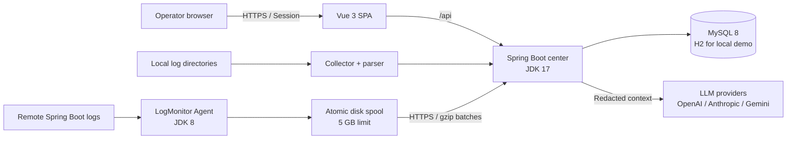

# LogMonitor


面向内部运维团队的日志分析平台：从本地目录或远端服务器持续采集 Spring Boot 文本日志，识别访问和跨行异常，按应用命名空间聚合趋势，并在脱敏后按需调用多供应商 LLM 生成分析。

LogMonitor is an operations-focused log analytics platform. It continuously ingests Spring Boot text logs from local directories or remote servers, recognizes requests and multi-line failures, aggregates trends by application namespace, and optionally sends redacted context to multiple LLM providers for analysis.

当前版本 / Current version: **v1.1.3**

采集目录支持中心本机与新版 Agent 的实时逐层下拉浏览，同时保留手动输入；远程节点需升级 Agent 至 1.1.3。

## 语言 / Languages

| 完整文档 / Full guide | 入口 / Entry |
| --- | --- |
| 简体中文 + English | 本页 / This page |
| 繁體中文 | [docs/README-zh-TW.md](docs/README-zh-TW.md) |
| 日本語 | [docs/README-ja-JP.md](docs/README-ja-JP.md) |
| 한국어 | [docs/README-ko-KR.md](docs/README-ko-KR.md) |
| Español | [docs/README-es-ES.md](docs/README-es-ES.md) |
| Français | [docs/README-fr-FR.md](docs/README-fr-FR.md) |
| Deutsch | [docs/README-de-DE.md](docs/README-de-DE.md) |
| Português (Brasil) | [docs/README-pt-BR.md](docs/README-pt-BR.md) |

## 项目概览 / Overview

### 能力 / What it does

- 本地目录和远端 Agent 双路径采集，断点续传、轮转识别、批次幂等和 5 GB 磁盘队列。
- 按应用命名空间、日志来源、实例、URI 和分钟聚合访问量，支持跨服务器汇总与来源下钻。
- 将跨行异常归类为业务异常或系统异常，按稳定指纹聚合错误组并保留脱敏发生记录。
- 提供总览、接口趋势、错误日志流、单次错误详情、采集状态和 Agent 管理页面。
- 支持 OpenAI 兼容、Anthropic、Gemini 等协议；错误组和单次错误分析按模型、提示词版本和语言缓存。
- 支持简体中文、繁體中文、English、日本語、한국어、Español、Français、Deutsch、Português。

### 边界 / Scope

当前版本不包含告警通知、错误认领流转、原始日志归档、Kafka、SSH 拉取、Agent 自动升级、多中心高可用、Windows Agent 或 Kubernetes Sidecar。

The current release does not include alerting, incident ownership workflows, raw-log archiving, Kafka, SSH pulling, automatic Agent upgrades, multi-center HA, Windows Agent, or Kubernetes Sidecar support.

## 架构 / Architecture

以下 Mermaid 图和 [服务架构说明](docs/ARCHITECTURE.md) 是精确的实现基线。图中 Agent 只负责文件发现、增量读取、可靠排队和上传，解析、脱敏、分类和存储统一在中心端完成。

The Mermaid diagram and [architecture reference](docs/ARCHITECTURE.md) are the implementation source of truth. Agents discover files, read incrementally, queue batches, and upload them; parsing, redaction, classification, and storage stay centralized.



### 模块 / Modules

| 目录 / Directory | 作用 / Responsibility | 产物 / Artifact |
| --- | --- | --- |
| `frontend/` | Vue 3 UI, i18n, filters, charts, session flows | Vite static assets |
| `backend/` | REST API, security, ingestion, parsing, storage, AI | Spring Boot executable JAR |
| `agent/` | Remote registration, file tailing, queue, upload, heartbeat | `logmonitor-agent.jar` |
| `deploy/` | Release/install scripts and MySQL DBA scripts | Versioned tarballs and SQL |
| `docs/` | Architecture, deployment, localized README entries | Maintainer documentation |

## Quick Start

### 环境 / Prerequisites

| 组件 / Component | 版本 / Version | 用途 / Use |
| --- | --- | --- |
| JDK | 17 | 中心端 / backend |
| JDK | 8 | Agent |
| Maven | 3.9+ | Java builds |
| Node.js | 20.19+ or 22.12+ | Frontend build |
| MySQL | 8.0.36+ | Production only; local uses H2 |

### 1. 启动中心端 / Start the backend

```bash
cd backend
cp config/application.example.yml src/main/resources/application.yml
cp config/application-prod.example.yml src/main/resources/application-prod.yml
mkdir -p logs/service-a
export JAVA_HOME=/path/to/jdk-17
export LOG_MONITOR_ADMIN_USERNAME=admin
export LOG_MONITOR_ADMIN_PASSWORD=change-me
export LLM_CONFIG_MASTER_KEY="$(openssl rand -base64 32)"
export SPRING_CONFIG_ADDITIONAL_LOCATION=file:src/main/resources/
mvn -s settings-ci.xml spring-boot:run
```

健康检查 / Health check: `curl http://localhost:8080/api/health`

本地配置文件不会被 Git 跟踪，也不会打进 JAR。首次登录后可在采集页面添加 `logs/service-a` 等本地日志目录；H2 数据在后端停止后清空。

Local configuration files are not tracked by Git or packaged in the JAR. After signing in, add a local directory such as `logs/service-a` on the Sources page. Local mode uses an in-memory H2 database.

### 2. 启动前端 / Start the frontend

```bash
cd frontend
npm ci
npm run dev
```

打开 `http://localhost:5173`，默认本地账号为 `admin` / `change-me`。Vite 会把 `/api` 代理到 `http://localhost:8080`。

Open `http://localhost:5173`. The Vite dev server proxies `/api` to `http://localhost:8080`.

### 3. 启动 Agent（可选）/ Start an Agent (optional)

```bash
cd agent
export JAVA_HOME=/path/to/jdk-8
mvn clean package
mkdir -p ../.runtime/logmonitor-agent/data
java -jar target/logmonitor-agent.jar configure \
  --config ../.runtime/logmonitor-agent/agent.json
java -jar target/logmonitor-agent.jar check \
  --config ../.runtime/logmonitor-agent/agent.json \
  --data ../.runtime/logmonitor-agent/data
java -jar target/logmonitor-agent.jar run \
  --config ../.runtime/logmonitor-agent/agent.json \
  --data ../.runtime/logmonitor-agent/data
```

远程中心默认必须使用 HTTPS；临时测试远程 HTTP 时显式增加 `--allow-http`。该模式会明文传输凭证、Token 和日志数据，不适用于生产。

Remote centers must use HTTPS by default. Add `--allow-http` only for temporary local testing; HTTP exposes credentials, tokens, and log data.

更多 Agent 注册、目录权限和升级说明见 [deploy/README.md](deploy/README.md#安装-agent)。

## 生产部署 / Production Deployment

前端、后端和 Agent 是三个独立发布单元。先由 DBA 执行空库初始化脚本或按顺序执行增量 SQL，再启动后端：

The frontend, backend, and Agent are independent release units. A DBA must initialize or upgrade MySQL before the backend starts:

```bash
mysql -h DB_HOST -u ADMIN_USER -p DB_NAME < deploy/mysql/logm-init.sql
```

```bash
cd frontend && ./deploy/release.sh
cd ../backend && export JAVA_HOME=/path/to/jdk-17 && ./deploy/release.sh
cd ../agent && export JAVA_HOME=/path/to/jdk-8 && ./deploy/release.sh
```

当前版本产物示例 / Current artifact names:

```text
release/logmonitor-frontend-1.1.3.tar.gz
release/logmonitor-backend-1.1.3.tar.gz
release/logmonitor-agent-1.1.3.tar.gz
```

安装脚本默认将后端以 nohup 运行在 `/opt/logmonitor/backend`，前端由 Nginx 提供并监听 `127.0.0.1:8081`，Agent 使用 `/opt/logmonitor-agent` 和 `/var/lib/logmonitor-agent`。生产入口必须由 TLS 反向代理保护并保持页面与 `/api` 同源。

The installers run the backend with nohup, serve the frontend through Nginx on `127.0.0.1:8081`, and keep Agent state under `/var/lib/logmonitor-agent`. Put a TLS reverse proxy in front and keep the page and `/api` same-origin.

完整参数、SHA-256 校验、升级、回滚和 nohup 运维命令见 [发布与安装说明](deploy/README.md)。

## 配置与安全 / Configuration and Security

- `backend/config/application*.example.yml` 是唯一受 Git 管理的 application 配置；复制后的实际配置及测试配置均被忽略。
- 生产使用 `SPRING_PROFILES_ACTIVE=prod`、MySQL 8.0.36+ 和 InnoDB；当前结构基线为 Flyway V14，生产启动只读校验 `schema_metadata`，不会自动执行 Flyway 迁移。
- `LOG_MONITOR_ADMIN_PASSWORD`、`DB_PASSWORD` 和 `LLM_CONFIG_MASTER_KEY` 必须通过环境变量或密钥服务注入，不能提交到仓库。
- Cookie 使用 `HttpOnly`、`SameSite=Strict`，生产默认启用 `Secure`；浏览器写操作使用 CSRF Token，Agent 使用 Bearer Token。
- Agent 只读取注册时声明且位于允许根目录下的文件；令牌仅在注册响应返回一次，中心只保存 SHA-256 摘要。
- 发送给 LLM 前会脱敏 token、Cookie、密码、手机号、身份证和 IP；不发送请求头、请求体或原始日志文件。
- `LLM_CONFIG_MASTER_KEY` 用于 AES-256-GCM 加密保存供应商 API Key；生产供应商 Base URL 必须为 HTTPS。

See [.env.example](.env.example), the application examples in `backend/config/`, [MySQL scripts](deploy/mysql/README.md), and the [security section of the architecture reference](docs/ARCHITECTURE.md#7-安全模型) before deploying.

## 数据口径 / Data Semantics

- `OncePerRequest` 请求起始行计为一次访问；缺失的方法、状态码或耗时不会被虚构。
- `LoginInterceptor` 只输出 URI 的 ERROR 属于噪声，会被排除。
- 同线程 2 秒内连续包装异常合并；错误指纹由命名空间、根异常、归一化摘要和首个业务栈帧组成。
- 访问去重键包含来源、文件、偏移和内容；错误上下文最多保存 100 行或 16 KB。
- 默认保留期为 180 天；每天 `Asia/Shanghai` 03:15 清理聚合、错误、AI、去重和批次元数据。

## API 与文档 / API and Documentation

公开 API 分为浏览器 Session API、监控与管理 API、Agent 协议 API。常用入口包括：

| Method | Path | Purpose |
| --- | --- | --- |
| `GET` | `/api/health` | Health check |
| `POST` | `/api/auth/login` | Session login |
| `GET` | `/api/dashboard/summary` | Dashboard aggregates |
| `GET` | `/api/errors/occurrences` | Redacted error stream |
| `POST` | `/api/agent/v1/enroll` | One-time Agent enrollment |
| `POST` | `/api/agent/v1/batches` | Authenticated gzip batch ingest |

完整 REST 表、权限矩阵、数据模型和故障恢复流程见 [docs/ARCHITECTURE.md](docs/ARCHITECTURE.md) 与 [docs/RUNTIME_ARCHITECTURE.md](docs/RUNTIME_ARCHITECTURE.md)。

## 测试 / Tests

```bash
cd backend
export JAVA_HOME=/path/to/jdk-17
mvn -s settings-ci.xml test

cd ../frontend
npm run build
npm test

cd ../agent
export JAVA_HOME=/path/to/jdk-8
mvn test
```

后端测试覆盖采集、解析、去重、错误分类、命名空间、Agent、LLM 配置和脱敏；前端测试覆盖路由、筛选器、国际化、主题、空数据和设置页；Agent 测试覆盖文件读取、预检和队列行为。

发布脚本的 `--version` 只用于断言源码版本，不能覆盖版本号。版本变更后同步更新发布示例、Agent 运行时版本和受影响测试 fixture。

## 贡献 / Contributing

1. 从当前主线创建分支，保持改动聚焦并补充对应测试。
2. 若修改模块职责、运行流程、API、数据库、配置、权限、部署或运维方式，同一提交必须更新架构文档。
3. 提交前运行后端、前端和 Agent 测试，并执行 `git diff --check`。
4. 使用简洁的 Conventional Commit；不要提交密钥、`.env`、IDE 配置、缓存、日志或构建产物。

## License

LogMonitor is released under the [MIT License](LICENSE).

## 采集性能与隔离压测

Agent 使用 `AGENT_UPLOAD_WORKERS`（默认 2，1–4）控制上传并发，中心使用 `INGEST_MAX_INFLIGHT`（默认 4，1–64）控制上传事务并发。配置、心跳与查询不占用上传许可，成功 ACK 仍保证事务已提交。压测入口、环境记录与容量验收边界见 [压测说明](tools/performance/README.md) 和 [架构文档](docs/ARCHITECTURE.md)。
