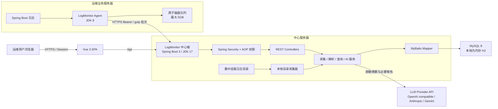
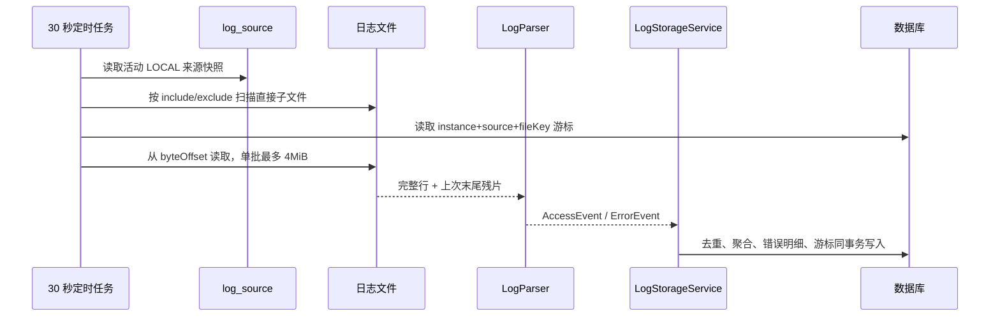

# LogMonitor 服务架构说明

> 文档状态：当前实现基线；数据库版本：Flyway V14；中心端：JDK 17 / Spring Boot 3；Agent：JDK 8
> 最后核对日期：2026-08-21

本文档描述仓库当前已经实现的架构，不是未来方案。面向开发、测试、部署和运维人员，用于回答以下问题：

- 服务由哪些模块组成，各自负责什么。
- 本地目录和远端服务器日志如何进入中心端。
- 日志如何解析、脱敏、去重、聚合和查询。
- 用户、Agent、权限和密钥如何管理。
- 如何在本地快速启动，如何部署到 MySQL 和 Linux 服务器。
- 后续版本发生变化时，哪些文档必须同步维护。

配套的 [运行架构图谱](RUNTIME_ARCHITECTURE.md) 从运行时视角进一步拆解物理部署、中心进程、认证授权、本地采集、
Agent 控制面与数据面、事件转换、20 张数据表、命名空间聚合、LLM 调用、状态机和故障恢复。本文继续作为配置、接口、部署与运维事实的主基线。

## Quick Start

### 1. 环境准备

| 组件 | 版本 | 用途 |
| --- | --- | --- |
| JDK | 17 | 构建和运行中心端 |
| JDK | 8 | 构建和运行远端 Agent |
| Maven | 3.9+ | 后端和 Agent 构建 |
| Node.js | 20.19+ 或 22.12+ | 前端构建；Vite 7 不支持 Node 18 |
| npm | 随 Node.js 安装 | 前端依赖和脚本 |
| MySQL | 8.0.36+ | 生产数据库；本地 Quick Start 不需要 |

先确认工具版本：

```bash
java -version
mvn -version
node -v
npm -v
```

中心端必须使用 JDK 17。若机器上安装了多个 JDK，在执行 Maven 命令前显式设置 `JAVA_HOME`。

### 2. 安装前端依赖

前端和后端是独立运行单元。开发环境由 Vite 提供页面并代理 `/api`，生产产物写入 `frontend/dist` 后由 Nginx 提供。

```bash
cd frontend
npm ci
```

### 3. 启动本地中心端

```bash
cd ../backend
cp config/application.example.yml src/main/resources/application.yml
cp config/application-prod.example.yml src/main/resources/application-prod.yml
mkdir -p logs/service-a
export JAVA_HOME=/path/to/jdk-17
export LOG_MONITOR_ADMIN_USERNAME=admin
export LOG_MONITOR_ADMIN_PASSWORD=change-me
export LLM_CONFIG_MASTER_KEY="$(openssl rand -base64 32)"
export SPRING_CONFIG_ADDITIONAL_LOCATION=file:src/main/resources/
mvn -s settings-ci.xml spring-boot:run
```

后端只提供 API，健康检查地址为：

```bash
curl http://localhost:8080/api/health
```

本地默认行为：

- 使用 Spring Boot 自动配置的内存型 H2，中心端停止后数据清空。
- 不预置任何业务日志源；登录后从采集页面添加 `logs/service-a` 等本地目录。
- application 实际配置不受 Git 管理，也不会打进 JAR；启动时从显式外部路径加载。
- 首次采集回溯最近 180 天，之后每 30 秒扫描增量。
- 默认账号和 `change-me` 只允许用于本地开发，生产环境必须覆盖。

### 4. 启动本地前端

中心端保持运行，再启动 Vite：

```bash
cd frontend
npm run dev
```

访问 `http://localhost:5173` 并使用上面配置的账号登录。Vite 将 `/api` 代理到 `http://localhost:8080`；生产发布时前端和后端分别打包。

### 5. 启动一个本地 Agent

先确保中心端已经启动，再用 JDK 8 构建 Agent：

```bash
cd agent
export JAVA_HOME=/path/to/jdk-8
mvn clean package

mkdir -p ../.runtime/logmonitor-agent/data
java -jar target/logmonitor-agent.jar configure \
  --config ../.runtime/logmonitor-agent/agent.json
```

`configure` 依次要求输入：

1. 中心地址。本机调试可使用 `http://127.0.0.1:8080`；远程中心默认必须使用 HTTPS，临时 HTTP 环境需在 `configure` 命令中显式增加 `--allow-http`。
2. 已存在且可用的 LogMonitor 用户名和密码。
3. 唯一 Agent 名称。
4. 一个或多个允许读取的绝对根目录，多个目录以逗号分隔。
5. 用于界面展示的服务器 IP；默认自动探测首个非回环 IPv4，可手工覆盖。

注册成功后启动 Agent：

```bash
java -jar target/logmonitor-agent.jar check \
  --config ../.runtime/logmonitor-agent/agent.json \
  --data ../.runtime/logmonitor-agent/data

java -jar target/logmonitor-agent.jar run \
  --config ../.runtime/logmonitor-agent/agent.json \
  --data ../.runtime/logmonitor-agent/data
```

另一个终端可检查状态：

```bash
java -jar target/logmonitor-agent.jar status \
  --config ../.runtime/logmonitor-agent/agent.json \
  --data ../.runtime/logmonitor-agent/data
```

在中心端“服务器”页确认 Agent 在线，然后在“采集”页选择该 Agent、新增远端日志目录。注册时输入的用户密码不会写入磁盘；Agent 配置只保存独立令牌，文件权限设为 `0600`。

## 1. 系统定位与边界

LogMonitor 是面向内部运维人员的单中心日志分析平台，当前能力包括：

- 采集中心服务器挂载目录中的 Spring Boot 文本日志。
- 通过轻量 Agent 采集其他服务器上的日志。
- 按应用命名空间、日志来源、URI 和分钟聚合接口访问量，并支持跨 Agent 汇总和来源下钻。
- 将跨行堆栈分类为系统异常或业务异常，并按错误指纹聚合。
- 保存脱敏后的错误明细和推断接口，提供错误分组、按应用命名空间实时轮询的错误日志流和单次错误下钻。
- 通过 OpenAI 兼容、Anthropic 或 Gemini 协议按错误组或单次错误调用 LLM，分别缓存结构化原因分析和修复建议。
- 管理内部用户、日志源、Agent 和采集状态。

当前明确不包含：告警通知、错误认领流转、原始日志归档、Kafka、SSH 拉取、Agent 自动升级、多中心高可用、Windows Agent 和 Kubernetes Sidecar。

## 2. 总体架构



中心端是当前唯一的解析和查询入口。Agent 不理解业务异常规则，只负责文件发现、增量读取、可靠排队和上传；这样本地采集与远端采集始终复用同一套解析、脱敏、分类和存储规则。

## 3. 仓库模块

| 路径 | 运行时 | 主要职责 | 主要产物 |
| --- | --- | --- | --- |
| `frontend/` | 浏览器 | 登录、总览、接口、错误、采集、服务器、用户管理、三态主题和九语言国际化 | Vite 静态资源 |
| `backend/` | JDK 17 | API、认证授权、采集、解析、查询、AI、保留策略 | Spring Boot 可执行 JAR |
| `agent/` | JDK 8 | 远端注册、目录校验、增量读取、磁盘队列、上传和心跳 | `logmonitor-agent.jar` |
| `frontend/deploy/` | 构建机 / Nginx | 前端测试、打包、版本目录安装和 Nginx 配置 | 前端发布包与安装脚本 |
| `backend/deploy/` | 构建机 / Linux | 后端测试、打包、依赖检查、nohup 进程和环境文件安装 | 后端发布包与安装脚本 |
| `agent/deploy/` | 构建机 / Linux | Agent 测试、打包、启动预检和 nohup 进程安装 | Agent 发布包与安装脚本 |
| `deploy/mysql/` | MySQL 8 | 全新建库、重置派生数据、历史升级和同步核验 SQL | DBA 脚本 |
| `backend/config/` | 配置模板 | 不含实际基础设施信息的 application example | 本地与生产配置起点 |
| `docs/` | 文档 | 当前架构、部署、接口和维护基线 | 本文档 |

## 4. 中心端分层

### 4.1 Web 与控制器

- Spring Boot 同时托管 `/api/**` 和前端静态资源。
- `SpaController` 将 `/dashboard`、`/endpoints`、`/errors`、`/sources`、`/agents`、`/users` 等路由转发到 SPA。
- Controller 只处理协议、校验和权限声明，核心规则在 Service 中。
- 所有时间以 UTC 进入数据库，浏览器默认按本地时区展示。

### 4.2 业务服务

| 服务 | 职责 |
| --- | --- |
| `LogCollectorService` | 本地文件扫描、轮转/截断识别、增量游标、批量读取和来源级并发协调 |
| `AgentService` | Agent 注册、令牌签发、配置版本、心跳、状态计算和撤销 |
| `AgentIngestService` | gzip 批次限制、校验和、偏移连续性、幂等 ACK、内存解压和中心解析 |
| `LogSourceService` | YAML 首次迁移、数据库动态来源、最多 50 行批量创建、路径/Glob/允许根校验和软删除 |
| `NamespaceMigrationService` | 持久化命名空间迁移、暂停来源、访问重归属、错误组拆分/合并和重启恢复 |
| `LogParser` | 多行事件、请求识别、错误去噪、分类、包装异常合并、指纹和接口推断 |
| `RedactionService` | token、Cookie、密码、手机号、身份证、IP 等敏感信息脱敏 |
| `LogStorageService` | 分钟聚合、访问去重、错误分组/明细和采集游标事务写入 |
| `QueryService` | 总览、排行、趋势、错误、来源和实例筛选 |
| `ErrorOccurrenceService` | 服务必选的错误日志流、24 小时默认范围、稳定正倒序、增量快照和单次详情 |
| `LlmConfigurationService` | 全局供应商/模型、用户偏好、系统默认、回退、连接测试和批量导入 |
| `LlmSecretService` | 使用 AES-256-GCM 加密和解密供应商 API Key |
| `LlmClientService` | OpenAI 兼容、Anthropic 和 Gemini 协议适配、响应超时和有限重试；DeepSeek 结构化分析关闭思考模式并启用 JSON Output |
| `LlmModelDiscoveryService` | 供应商模型列表拉取、协议分页解析、官方目录和响应上限 |
| `AiAnalysisService` | 脱敏错误的异步分析、按请求语言生成、结构化解析、跨用户模型缓存和失败状态 |
| `OccurrenceAiAnalysisService` | 单次错误脱敏上下文的异步分析，按发生记录、模型、提示词版本和语言隔离缓存 |
| `AiAnalysisSupport` | 错误组与单次错误共用的本地化提示词、结构化 JSON 解析和结果序列化 |
| `LocaleSupport` | 只接受九种已支持 locale，统一解析 `Accept-Language` 并为 Advice、Spring Security 和 Agent 过滤器提供消息 |
| `RetentionService` | 每日删除超过保留期的聚合、错误、AI、去重和批次元数据 |
| `AccountService` | 根用户初始化、普通用户创建、改密、停用、启用、删除和会话撤销 |

### 4.3 数据访问

- 使用 MyBatis 注解 Mapper，不引入 ORM 实体生命周期。
- `schema_metadata` 是生产运行时读取的结构版本来源，当前最高版本为 Flyway V14。
- MySQL 使用 `db/migration` 与 `db/mysql-migration`；开发和 H2 测试由 Flyway 自动迁移，生产由 DBA 手工执行发布包中的相同 SQL。
- V1 至 V13 是不可修改的历史迁移；从 V14 开始只新增 SQL 迁移，不再新增 Java 迁移。
- 已有表通过 `ALTER TABLE` 原表名演进，表名和迁移中间表名都不得添加 `_vXX` 版本后缀。
- 每个新迁移必须把 `schema_metadata` 版本写入作为最后一条语句，并在同一提交中更新最终态基线及版本声明。
- 生产 profile 通过只读 `FlywayMigrationStrategy` 占用数据库初始化生命周期，只执行版本、MySQL 8.0.36+ 和 InnoDB 校验，不调用任何 Flyway 修改命令。
- 高频查询按时间、服务、实例和错误组建立索引。

## 5. 日志采集与处理流程

### 5.1 本地目录采集



关键规则：

- 路径必须位于 `LOG_SOURCE_ALLOWED_ROOTS` 或 `LOG_ROOT` 下，并通过 `toRealPath` 防止软链接越界。
- 默认 `include=*.log`、`exclude=*.error_*.log`，只扫描目录直接包含的文件。
- 游标唯一键为 `sourceId + fileKey`，并保存实例、generation、字节偏移和末尾残片；同 Agent 同名应用不会串游标。
- 文件追加从当前偏移继续；截断生成新流；重命名轮转尽量沿用文件标识。
- YAML 来源只在首次启动迁入数据库，之后数据库是动态来源的运行时真相。
- 删除来源会停止采集并清理游标，不删除已经生成的统计和错误数据。
- 采集页和服务器页的挂载目录都读取 `/api/sources/status` 活动来源；服务器页仅按 `collectorType=AGENT` 和 `agentId` 分组，不把历史只读实例计为当前挂载。

### 5.2 Agent 注册与配置

1. `configure` 验证中心 URL；除 localhost 外默认只允许 HTTPS。显式指定 `--allow-http` 时允许远程 HTTP，并把 `allowHttp=true` 写入本地配置，供 `check`、`run` 和 `status` 统一校验。
2. Agent 将用户凭证、名称、主机名、自动探测或覆盖的展示 IP、版本和真实允许根发送到注册接口。
3. 中心使用现有用户认证规则校验账号；停用或首次改密账号不能注册。
4. 中心生成 256 位随机令牌，只在注册响应中返回一次，数据库仅保存 SHA-256 摘要。
5. Agent 将配置原子写入 `agent.json` 并设置 `0600`。
6. 允许根在注册后固定，需要变更时撤销并重新注册。

### 5.3 Agent 运行循环

| 周期 | 任务 |
| --- | --- |
| 每 10 秒 | 使用 ETag/配置版本轮询远端来源配置 |
| 每 10 秒 | 锁外更新目录和 Glob 文件清单；既有文件连续轮转读取 |
| 连续调度 | 默认 2 个线程上传，同来源按偏移串行；空队列等待 1 秒 |
| 每 30 秒 | 上报版本、队列用量、来源校验和采集状态 |

配置更新移除来源时，Agent 立即停止派发并清理内存报告，待该来源在途任务结束后清理文件状态和磁盘队列；目录恢复后，下一次成功扫描会用正常报告覆盖旧异常，无须重启 Agent。后端心跳只处理属于当前 Agent 且未删除的来源，先持久化校验结果，再从当前有效来源汇总 `collector_agent.last_error`。`ACTIVE` 报告清空该来源的校验错误；漏报来源保留其既有校验结果，后端检测到的真实目录冲突同样参与汇总。所有有效来源的错误消除后，服务器错误清空；离线和队列阻塞仍优先于错误、在线状态。

Agent 先把 gzip 内容和 JSON 元数据分别原子写入磁盘队列，再推进本地游标。中心 ACK 后才删除队列文件，因此断网、Agent 重启或 ACK 丢失不会主动丢日志。队列达到 5GB 后暂停读取，保持现有批次并上报 `BLOCKED`。

### 5.4 批次接收与一致性

每个批次包含 `batchId/sourceId/fileKey/generation/path/startOffset/endOffset/fileSize/modifiedAt/charset/checksum`。中心端处理顺序：

1. Bearer Token 认证 Agent，确认来源属于该 Agent 且仍有效。
2. 非阻塞取得全局上传许可和来源锁；繁忙立即返回 503 和 Retry-After，不开启上传事务。在来源锁内检查来源状态和批次是否已经接收；锁持续到上传事务完成，确保批次提交、来源删除和命名空间迁移严格串行。
3. 限制压缩请求约 5MB、解压后内容最多 4MiB，并验证 SHA-256。
4. 校验文件路径位于来源目录内，校验 generation 和期望偏移。
5. 在内存中解压并调用与本地采集相同的解析、脱敏和存储逻辑。
6. 只保存批次幂等元数据，不保存原始 gzip 内容。

重复 `batchId` 直接 ACK；偏移不连续返回 `409 BATCH_OFFSET_CONFLICT` 和期望偏移，Agent 清理同一文件流的待发批次后回退重读；来源已删除返回 `410 SOURCE_DELETED`，Agent 删除相关游标和队列。

### 5.5 解析、脱敏和聚合

- 时间戳行开始一个事件，后续无时间戳行作为同一事件的堆栈。
- `OncePerRequest` 中的请求 URL/URI 计为一次访问；缺失的方法统一为 `UNKNOWN`。
- `LoginInterceptor` 只打印 URI 的 ERROR 作为噪声排除。
- 登录失效和业务校验归为 `BUSINESS`；SQL、启动、运行时和调度异常归为 `SYSTEM`。
- 同服务、同线程、2 秒内连续包装异常合并为一个逻辑错误事件。
- 错误签名由类别、根异常类、归一化消息和首个业务栈帧组成；最终指纹为“应用命名空间 + 错误签名”，同命名空间可跨服务器聚合同类错误。
- 访问聚合、访问事件和错误明细均保留 `sourceId`；去重键包含来源、文件、偏移和内容，命名空间迁移或重新扫描不会重复统计。
- 使用同线程最近且尚未完成的请求推断错误接口；没有可靠上下文时记为未关联。
- 错误上下文脱敏后最多保存 100 行或 16KB；普通原始日志不写数据库。

## 6. 查询与前端

前端采用 Vue 3、TypeScript、Vite、Vue Router、Pinia、Element Plus、ECharts 和 Lucide 图标。

| 页面 | 功能 |
| --- | --- |
| 登录 | Session 登录和明确失败状态 |
| 总览 | 应用命名空间/来源实例/自定义时间筛选，今天、昨天、7/14/30 天快捷区间，访问趋势、错误趋势和排行 |
| 接口 | URI 分页、搜索、平均/峰值频率和趋势下钻 |
| 错误 | 路由化的错误分组（展示历史首次发生时间）与错误日志流；日志流按命名空间聚合、来源下钻、10 秒增量检查、单次详情和独立 AI 分析 |
| 采集 | 本地/远端来源、校验状态、游标进度、批量新增、命名空间迁移和删除 |
| 服务器 | Agent 展示 IP、在线状态、版本、允许根、已挂载目录、队列和撤销 |
| 用户 | ROOT 创建、停用、启用和删除普通用户 |
| 设置 | 所有用户选择 LLM 模型；ROOT 管理供应商、模型、默认模型、连接测试、密钥轮换和模型拉取 |
| 修改密码 | 所有用户修改自身密码；临时密码用户强制进入 |

主题偏好保存在浏览器 `localStorage`，支持跟随系统、浅色和深色。语言偏好使用 `log-monitor-locale` 保存，首次按 `navigator.languages` 匹配九种语言，未匹配时回退 `zh-CN`。Vue I18n、Element Plus、Day.js、Intl 与 ECharts 共享当前 locale，Axios 同步发送 `Accept-Language`。监控查询先选 `applicationNamespace`，再可选具体 `sourceId`；实例标签由后端统一输出 `displayAddress：applicationName（path）`，未选择来源时跨 Agent、跨目录求和。命名空间和实例选项只读取当前活动日志源；来源删除后立即从全局选项中移除并清理前端失效选择，已解析的历史统计仍按保留策略保存并可通过明确参数查询。

错误模块的 `/errors/groups` 保留指纹聚合视图，`/errors/logs` 要求先选择应用命名空间，默认查询滚动最近 24 小时。筛选、排序和页码写入 URL；前端每 10 秒使用 `snapshotId` 调用增量接口。页面隐藏或用户暂停时停止轮询，恢复可见后立即补查；只有倒序第一页且表格位于顶部时自动刷新，否则显示新增数量，避免阅读位置跳动。进入 `/errors/logs/{occurrenceId}` 才读取完整脱敏消息和堆栈，进入详情不会自动产生 LLM 费用。

错误分组列表与详情抽屉的“首次发生”读取 `error_group.first_seen`，不受查询时间范围和应用实例筛选影响；次数和最近发生仍按当前筛选内的记录统计，列表默认按最近发生倒序。历史首次时间以现有错误组保存值为准，不恢复已删除组的历史；命名空间迁移沿用现有重算规则。`v1.0.4` 复用已有 API 字段和数据库列，无须数据库迁移。

API 成功数据保持稳定技术字段；用户可见失败统一返回 `{ code, message }`，`code` 是机器协议，`message` 由受限的 `Accept-Language` 本地化。上游 LLM 技术明细和日志内容保留原文。

## 7. 安全模型

### 7.1 用户认证和权限

- Spring Security 使用 BCrypt 验证密码和 HttpSession 保存登录状态。
- Session Cookie 为 `HttpOnly`、`SameSite=Strict`；生产默认启用 `Secure`。
- 浏览器写操作使用 Cookie CSRF Token；Agent 协议使用 Bearer Token，不使用浏览器 Session。
- `AccountSessionFilter` 每次 API 请求检查账号是否存在、是否启用以及 `sessionVersion` 是否一致。
- 业务权限由 `@RequirePermission` 和 `PermissionAspect` 执行，前端隐藏入口不作为安全边界。

| 权限 | ROOT | USER |
| --- | --- | --- |
| `MONITOR_READ` | 是 | 是 |
| `SOURCE_MANAGE` | 是 | 是 |
| `AGENT_MANAGE` | 是 | 是 |
| `AI_ANALYZE` | 是 | 是 |
| `LLM_PREFERENCE` | 是 | 是 |
| `LLM_CONFIG_MANAGE` | 是 | 否 |
| `CHANGE_OWN_PASSWORD` | 是 | 是 |
| `USER_MANAGE` | 是 | 否 |

`mustChangePassword=true` 的用户只能查询自身身份、退出和修改密码。停用、删除或会话版本变化会在下一次请求时使旧 Session 失效。

### 7.2 Agent 安全

- 注册用户后续改密、停用或删除不会自动撤销已经签发的 Agent；需要在“服务器”页显式撤销。
- 撤销后令牌立即失效，同时停用该 Agent 的全部来源。
- 生产必须使用 HTTPS，证书 SAN 必须包含 Agent 实际访问的 IP 或域名，并由 JDK 8 信任库信任。
- 远程 HTTP 仅能通过 `configure --allow-http` 显式开启；此时注册密码、Agent Token 和采集日志均为明文传输，应在 TLS 配置完成后撤销 Agent 并通过 HTTPS 重新注册。
- 不提供跳过证书校验的生产选项。
- 数据库、LLM 主密钥和管理员初始密码必须通过环境变量或密钥服务注入。

### 7.3 LLM 密钥安全

- `LLM_CONFIG_MASTER_KEY` 必须是 Base64 编码的 32 字节密钥；缺失或格式错误时中心端快速失败。
- 供应商 API Key 以随机 96 位 nonce 和 AES-256-GCM 加密保存。轮换密钥会生成新的 nonce，删除供应商会物理删除密文。
- API、页面、应用日志和异常只暴露 `apiKeyConfigured`，不返回明文、密文、nonce 或掩码片段。
- 生产环境供应商 Base URL 只允许 HTTPS；本机协议模拟测试可通过 `LLM_ALLOW_HTTP=true` 临时允许 HTTP。
- 发送给供应商的内容限于已经脱敏的错误摘要、异常类别、根因类和必要堆栈，不包含请求头、Cookie、Token 或请求体。
- 模型发现使用与供应商调用相同的服务端密钥；未保存表单中的密钥只用于当前请求，发现响应不包含密钥或上游响应体。

### 7.4 模型发现与导入

- `OPENAI`、`DEEPSEEK`、`KIMI`、`MINIMAX` 和自定义 OpenAI 兼容服务读取 `{baseUrl}/models`；Anthropic 和 Gemini 使用各自模型列表协议及分页字段。
- `QWEN` 和 `ZHIPU` 没有账号级通用模型列表接口，中心返回版本化官方文本模型目录，并在页面标注目录不是当前账号实时权限。
- 在线发现失败不会降级为静态目录。ROOT 必须通过可搜索多选下拉框显式选择并导入模型；已有模型、远端未返回模型、默认模型和用户偏好均不会被自动修改。
- 单次发现和导入最多处理 1000 个模型；供应商内模型 ID 忽略大小写去重，已配置条目按幂等跳过。

## 8. 数据模型

| 表 | 内容 | 保留/唯一性 |
| --- | --- | --- |
| `schema_metadata` | 生产数据库结构版本 | component 唯一；LogMonitor 固定记录一行 |
| `app_user` | 用户、角色、BCrypt、启用状态、强制改密和会话版本 | 用户名唯一 |
| `collector_agent` | UUID、令牌摘要、主机、展示 IP、版本、心跳、队列和配置版本 | UUID、名称、令牌摘要唯一；撤销为软删除 |
| `agent_allowed_root` | Agent 注册时固定的允许根和真实路径 | Agent + 路径摘要唯一 |
| `log_source` | 应用名称、命名空间、LOCAL/AGENT、目录、Glob、校验、采集起点和迁移状态 | 同实例真实路径唯一；应用名称可重复；删除为软删除 |
| `source_namespace_migration` | 来源命名空间变更、执行状态、失败信息和执行时间 | 持久化任务支持启动恢复 |
| `collector_checkpoint` | 文件标识、generation、偏移、末尾残片和采集状态 | sourceId + fileKey 唯一 |
| `agent_ingest_batch` | 已接收批次 ID、文件流、偏移和校验和 | batchId 唯一；保留 180 天 |
| `api_access_minute` | 命名空间、来源、实例、URI、分钟和访问数 | sourceId + URI 摘要 + 分钟唯一 |
| `access_event_dedup` | 访问事件级去重键 | 事件键唯一 |
| `access_dedup_baseline` | 初始同步期间的分钟基线截止点 | sourceId + URI + 分钟唯一 |
| `error_group` | 命名空间错误指纹、独立错误签名、分类、摘要和累计次数 | 指纹唯一；签名可跨命名空间复用 |
| `error_occurrence` | 单次脱敏错误、堆栈、来源、实例和接口推断 | 事件键唯一 |
| `llm_provider_config` | 供应商、协议、Base URL、API Key 密文/nonce、启停和连接测试状态 | 供应商标准化名称唯一 |
| `llm_model_config` | 供应商下的模型 ID、显示名称和启停状态 | 供应商 + 标准化模型 ID 唯一 |
| `user_llm_preference` | 用户当前选择的模型 | 用户唯一；删除用户时级联清理 |
| `llm_system_setting` | ROOT 维护的系统默认模型 | 固定单行设置 |
| `ai_analysis` | 供应商/模型快照、语言、结构化结果、文本兜底、Token 用量和失败原因 | 错误组 + 模型配置 + 提示词版本 + locale 唯一 |
| `error_occurrence_ai_analysis` | 单次错误的模型/供应商快照、语言、结构化结果、文本兜底和 Token 用量 | 发生记录 + 模型配置 + 提示词版本 + locale 唯一；发生记录删除时级联清理 |
| `app_setting` | YAML 来源是否迁移等应用级状态 | settingKey 唯一 |

所有业务时间按 UTC 存储。每天 `Asia/Shanghai` 03:15 清理超过 `retentionDays` 的聚合、错误、AI、访问去重、基线和 Agent 批次元数据；默认保留 180 天。

## 9. REST API

### 9.1 用户 Session API

| 方法 | 路径 | 权限/说明 |
| --- | --- | --- |
| GET | `/api/auth/csrf` | 获取浏览器 CSRF Token |
| POST | `/api/auth/login` | 用户名密码登录 |
| POST | `/api/auth/logout` | 注销当前 Session |
| GET | `/api/auth/me` | 当前用户名、角色和强制改密状态 |
| POST | `/api/auth/password` | 修改自身密码并销毁当前 Session |

### 9.2 监控与管理 API

| 方法 | 路径 | 权限/说明 |
| --- | --- | --- |
| GET | `/api/dashboard/summary` | 总览；支持 `from/to/applicationNamespace/sourceId`，兼容 `service/agentId` |
| GET | `/api/endpoints` | 接口分页；按应用名称和 URI 聚合，命名空间仅作为筛选和独立响应字段，支持来源和关键词 |
| GET | `/api/endpoints/{id}/trend` | 同一应用名称跨来源聚合的单接口趋势；指定来源时下钻到该目录 |
| GET | `/api/errors/groups` | 错误组分页和筛选 |
| GET | `/api/errors/groups/{id}` | 错误组详情 |
| GET | `/api/errors/groups/{id}/occurrences` | 发生记录；支持服务器筛选 |
| GET/POST | `/api/errors/groups/{id}/ai-analysis` | 按请求语言查询或触发 AI 分析；无同语言结果时只回退展示已有结果 |
| GET | `/api/errors/groups/{id}/ai-analyses` | 查询该错误组的跨模型、跨语言历史 |
| GET | `/api/errors/occurrences` | 错误日志流；必填 `applicationNamespace`，支持 `sourceId/from/to/category/keyword/sort/page/pageSize`，兼容旧参数并返回 `snapshotId` |
| GET | `/api/errors/occurrences/updates` | 使用相同筛选和 `afterId` 检查新增数量及最新 ID |
| GET | `/api/errors/occurrences/{id}` | 单次错误完整脱敏详情、来源、偏移、实例和错误组指纹 |
| GET/POST | `/api/errors/occurrences/{id}/ai-analysis` | 查询或按需触发该次错误的当前模型、当前语言分析 |
| GET | `/api/errors/occurrences/{id}/ai-analyses` | 查询该次错误的跨模型、跨语言历史 |
| GET | `/api/settings/llm` | 查询可选模型、用户偏好、实际模型和回退状态 |
| PUT | `/api/settings/llm/preference` | ROOT/USER 修改自身模型偏好 |
| GET/POST/PUT/DELETE | `/api/admin/llm/providers/**` | ROOT 管理供应商和供应商模型 |
| PATCH | `/api/admin/llm/providers/{id}/status` | ROOT 启停供应商 |
| PUT | `/api/admin/llm/default-model` | ROOT 设置系统默认模型 |
| POST | `/api/admin/llm/connection-tests` | ROOT 测试已保存或未保存的连接配置 |
| POST | `/api/admin/llm/model-discovery` | ROOT 使用未保存的供应商表单拉取模型 |
| POST | `/api/admin/llm/providers/{id}/model-discovery` | ROOT 使用已保存或临时覆盖的地址/密钥拉取模型 |
| POST | `/api/admin/llm/providers/{id}/models/import` | ROOT 批量导入下拉框选中的模型，已存在模型幂等跳过 |
| GET | `/api/services` | 当前活动来源命名空间名称列表的兼容别名 |
| GET | `/api/applications/options` | 当前活动命名空间及 `IP：应用名称（完整目录）` 来源实例列表 |
| GET | `/api/sources/status` | 来源和游标状态 |
| GET | `/api/sources/options?agentId=` | 本地或远端允许根与默认 Glob |
| POST | `/api/sources` | 新增单个 LOCAL 或 AGENT 来源，支持应用命名空间 |
| POST | `/api/sources/batch` | 固定采集节点下一次事务新增最多 50 个来源 |
| PATCH | `/api/sources/{id}/namespace` | 返回 202，异步迁移保留期历史并暂停该来源采集 |
| DELETE | `/api/sources/{id}` | 删除来源并清理游标 |
| GET | `/api/agents`、`/api/agents/{id}` | Agent 列表和详情 |
| DELETE | `/api/agents/{id}` | 撤销 Agent |
| GET/POST | `/api/users` | ROOT 查询和创建普通用户 |
| PATCH | `/api/users/{id}/status` | ROOT 停用或启用普通用户 |
| DELETE | `/api/users/{id}` | ROOT 永久删除普通用户 |

常规分页响应统一为 `{ items, total, page, pageSize }`，错误日志流额外返回 `snapshotId`。页码从 1 开始，后端将 `pageSize` 限制在 1 到 100；错误流默认最近 24 小时、最大 180 天，排序只接受 `ASC` 或 `DESC`。

### 9.3 Agent 协议 API

| 方法 | 路径 | 认证/说明 |
| --- | --- | --- |
| POST | `/api/agent/v1/enroll` | 一次性用户凭证，成功返回 Agent Token |
| GET | `/api/agent/v1/config` | Bearer Token；支持 ETag/304 |
| POST | `/api/agent/v1/heartbeat` | Bearer Token；上报队列和来源状态 |
| POST | `/api/agent/v1/batches` | Bearer Token；multipart 元数据 + gzip 内容 |

## 10. 关键配置

| 环境变量 | 默认值 | 说明 |
| --- | --- | --- |
| `SPRING_PROFILES_ACTIVE` | `local` | 生产设置为 `prod` |
| `SERVER_PORT` | `8080` | 中心端端口 |
| `DB_HOST/DB_PORT/DB_NAME` | 仅端口默认 `3306` | MySQL 连接目标，主机和库名必须显式设置 |
| `DB_USERNAME/DB_PASSWORD` | 无安全默认密码 | MySQL 凭证 |
| `LOG_MONITOR_ADMIN_USERNAME` | `admin` | 预置 ROOT 用户名 |
| `LOG_MONITOR_ADMIN_PASSWORD` | 本地 `change-me` | ROOT 首次密码；生产必填且启动不会覆盖已修改密码 |
| `LOG_ROOT` | `./logs` | example 中的通用本地日志根 |
| `LOG_SOURCE_ALLOWED_ROOTS` | `LOG_ROOT` | 逗号分隔的本地允许根 |
| `LOG_SCAN_INTERVAL_MS` | `30000` | 本地来源扫描周期 |
| `LLM_CONFIG_MASTER_KEY` | 无 | Base64 编码的 32 字节 AES 主密钥；启动必填且需稳定保存 |
| `LLM_ALLOW_HTTP` | `false` | 仅本机协议模拟测试时允许 HTTP Base URL |
| `LLM_TIMEOUT_SECONDS` | `120` | 正式分析单次响应超时；超时不会重复提交请求 |
| `LLM_TEST_TIMEOUT_SECONDS` | `15` | 连接测试超时 |
| `LLM_MAX_RETRIES` | `2` | 正式分析对网络、429 和 5xx 的最大重试次数 |
| `LLM_MAX_OUTPUT_TOKENS` | `2048` | 供应商请求的最大输出 Token |
| `SESSION_COOKIE_SECURE` | 生产 `true` | HTTPS 环境保持 true |

根目录 `.env.example` 还包含可选的本地图像生成工具变量 `OPENAI_BASE_URL` 和 `OPENAI_API_KEY`。它们不参与中心端运行时；实际密钥只应写入本地、权限设为 `0600` 的 `.env`，不得提交或复制到发布包。`backend/config/application*.example.yml` 是唯一受 Git 管理的 application 配置；复制后的实际文件由 `.gitignore` 排除。

## 11. 生产部署

### 11.1 MySQL 初始化

生产限定使用 MySQL 8.0.36+ / InnoDB。DBA 创建账号和网络策略后，对空数据库执行当前最终态脚本：

```bash
mysql -h DB_HOST -u ADMIN_USER -p < deploy/mysql/logm-init.sql
```

已有数据库先停止后端，查询 `schema_metadata`，再从发布包按版本顺序执行 `mysql/migrations/` 中所有缺失 SQL。V13 标准 MySQL 数据库首次切换到该流程时执行：

```sql
SELECT schema_version FROM schema_metadata WHERE component = 'logmonitor';
```

```bash
mysql -h DB_HOST -u ADMIN_USER -p DB_NAME < mysql/migrations/V14__schema_metadata.sql
```

生产启动只读校验结构版本、数据库版本和表引擎，永不执行 Flyway `migrate`、`repair`、`baseline` 或 `clean`。校验失败时进程在开放 HTTP 端口前退出。RDS DuckDB 必须按 [MySQL 数据库脚本说明](../deploy/mysql/README.md#从-rds-duckdb-迁移) 迁到标准 MySQL，不能通过修改 Flyway 历史绕过。

### 11.2 独立发布包

```bash
cd frontend
./deploy/release.sh

cd ../backend
export JAVA_HOME=/path/to/jdk-17
export PATH="$JAVA_HOME/bin:$PATH"
./deploy/release.sh

cd ../agent
export JAVA_HOME=/path/to/jdk-8
export PATH="$JAVA_HOME/bin:$PATH"
./deploy/release.sh
```

三个脚本分别执行测试、构建并在仓库 `release/` 生成带 SHA-256 的独立压缩包。版本覆盖、输出目录和跳过测试参数见 [发布与安装说明](../deploy/README.md)。

### 11.3 Linux 安装

`v1.0.3` 的异常恢复修复不改变 API 字段和数据库结构。升级时先部署后端和前端，再升级 Agent：后端兼容现有 `v1.0.0` Agent，忽略它持续上报的已删除来源报告；新版 Agent 进一步在配置更新时清理内存旧报告。已存储的服务器旧异常会在下一次成功心跳汇总时修正，无须手工修改数据库。

```bash
tar -xzf logmonitor-backend-1.1.2.tar.gz
sudo sh ./logmonitor-backend-1.1.2/start.sh
/opt/logmonitor/backend/logmonitor-backend.sh start

tar -xzf logmonitor-frontend-1.1.2.tar.gz
sudo SERVER_NAME=logmonitor.internal ./logmonitor-frontend-1.1.2/install.sh

tar -xzf logmonitor-agent-1.1.2.tar.gz
sudo ./logmonitor-agent-1.1.2/install.sh
/opt/logmonitor-agent/logmonitor-agent.sh start
```

后端安装后必须先修改 `/etc/logmonitor/backend.env`，再执行 `/opt/logmonitor/backend/logmonitor-backend.sh start`；控制脚本以 nohup 启动 JAR，并等待 `/api/health` 就绪。前端默认由 Nginx 监听 `127.0.0.1:8081`，生产 TLS 入口转发页面和 `/api`，保持同源；后端 `8080` 只暴露在受控内网。Agent 安装后，执行安装的原登录用户完成交互注册，再通过 `/opt/logmonitor-agent/logmonitor-agent.sh start` 启动；启动前 JAR 会校验本地配置、目录并使用 Token 请求中心配置接口。安装程序自动停用旧 systemd unit，运行中的旧版本迁移后恢复为 nohup 进程。安装路径、参数、配置保留和升级行为以 [发布与安装说明](../deploy/README.md) 为准。

## 12. 运维检查

### 12.1 常用状态

- `/api/health`：中心端存活检查。
- “服务器”页：Agent 在线、离线、阻塞、版本、心跳和队列占用。
- “采集”页：来源校验、文件数、读取字节、最近采集和解析错误。
- Agent `status`：Agent ID、中心连接、配置版本和本地队列用量。
- 后端/Agent nohup 控制脚本 `status` 与 `logs`：进程 PID 和标准输出日志。

中心超过 90 秒未收到心跳时显示 Agent 离线。来源状态含 `VALIDATING`、`ACTIVE`、`OFFLINE`、`BLOCKED` 和 `ERROR`。

“服务器”页每 10 秒自动刷新 `/api/agents` 和 `/api/sources/status`，同步服务器错误、在线状态、需关注数量和挂载目录；页面隐藏时暂停，恢复可见后立即刷新，离开页面时清理定时器和监听器。自动和手动刷新共用请求防重入，后台刷新不显示整页加载遮罩；任一请求失败时保留已有数据并显示请求错误，下次成功后清除。正常网络下，后端处理恢复心跳后，页面在下一个 10 秒刷新周期内反映恢复结果；实际目录修复还需等待 Agent 现有的配置、扫描和心跳周期。

### 12.2 常见故障定位

| 现象 | 优先检查 |
| --- | --- |
| Agent 无法注册 | 中心 HTTPS、用户是否停用/强制改密、Agent 名称是否重复、证书 SAN 和 JDK 8 信任库 |
| Agent 在线但来源等待校验 | 目录是否绝对且可读、真实路径是否位于允许根、Glob 是否有效 |
| Agent 阻塞 | 网络连通、中心 4xx/5xx、磁盘队列是否接近 5GB |
| 批次 409 | 文件是否截断、中心与 Agent 游标是否一致；Agent 会按期望偏移自动回退 |
| 本地来源无数据 | `LOG_SOURCE_ALLOWED_ROOTS`、软链接真实路径、include/exclude、采集状态页错误 |
| 中心端启动时报 LLM 主密钥错误 | `LLM_CONFIG_MASTER_KEY` 是否为稳定的 Base64 32 字节值；更换主密钥后旧密文无法解密 |
| AI 分析失败 | 设置页供应商/模型是否启用、连接测试、HTTPS Base URL、网络、限流和错误详情中的脱敏失败原因 |
| 登录后立即失效 | 账号启用状态、会话版本、Cookie Secure/HTTPS 和 CSRF 配置 |

数据库辅助脚本：

- `deploy/mysql/logm-init.sql`：当前 V14 最终态初始化脚本，仅用于全新数据库；包含 20 张表。
- `mysql/migrations/V{n}__*.sql`：后端发布包中的 V14+ 生产增量脚本，由 DBA 停止服务后逐版执行。
- `deploy/mysql/logm-verify-ingestion.sql`：只读核对统计、重复数据、游标和时间范围。
- `deploy/mysql/logm-reset-ingestion-data.sql`：停止中心端后清理日志派生数据，保留账号和结构版本记录。
- `deploy/mysql/logm-v5-incremental-cursor.sql`：仅供旧 V4 数据库升级，不能用于全新 V14 数据库。

## 13. 测试与发布门禁

### 13.1 版本约定

最新正式发布为 `v1.0.0`，当前源码版本为 `v1.1.2`。正式发布记录与源码版本分别维护，只有完成正式发布才更新发布记录。

- 每次普通 commit（包括文档、配置与项目约定）将当前 patch 加一，例如 `v1.0.0` -> `v1.0.1`。
- 每次正式发布将当前 minor 加一并将 patch 归零，例如 `v1.0.3` -> `v1.1.0`。
- 只有用户明确说“大版本发布”时才将 major 加一、minor 和 patch 归零，例如 `v1.x.y` -> `v2.0.0`；不根据变更规模或兼容性自行升级 major。
- 发布提交只执行一次对应的发布递增，不额外增加 patch；执行打包脚本本身不代表正式发布，也不修改版本。
- 每次提交前同步两个 POM 的项目版本、前端 package 和锁文件的根版本、Agent 运行时版本、受影响测试 fixture、各语言 README 的当前版本及部署产物示例。依赖版本与 Flyway 结构版本独立维护。

### 13.2 验证命令

```bash
cd backend
export JAVA_HOME=/path/to/jdk-17
mvn -s settings-ci.xml test

cd ../frontend
npm test
npm run build

cd ../agent
export JAVA_HOME=/path/to/jdk-8
mvn clean package

cd ..
for script in frontend/deploy/*.sh backend/deploy/*.sh backend/deploy/*.sh.template \
  agent/deploy/*.sh agent/deploy/*.sh.template; do bash -n "$script"; done
bash deploy/tests/nohup-control-test.sh
```

当前自动化覆盖用户权限和会话撤销、动态来源、运行时生成的匿名日志 fixture、增量/轮转/截断、解析脱敏、双 Agent 同服务、批次幂等/偏移/校验和、错误流稳定排序/筛选/增量快照/详情、单次 AI 缓存唯一性和级联清理、LLM 密钥加密、生成及模型发现协议、目录降级、批量导入、权限/默认/回退，以及前端主题、路由、日志流轮询、用户、来源、服务器和模型设置交互。

设置临时环境变量 `DEEPSEEK_SMOKE_API_KEY` 后，可运行 `LlmClientServiceDeepSeekSmokeTest` 验证真实 DeepSeek 非思考 JSON 分析链路；未设置时该测试自动跳过，密钥不得写入仓库或测试报告。

发布前还需验证三个压缩包的 SHA-256、`DESTDIR` 安装布局，以及目标环境的真实 TLS 信任链、Nginx 配置、Linux 文件权限、nohup 启停与主机重启后的手工恢复、MySQL 迁移备份和目标日志量下的查询与恢复性能。

### 13.4 第一阶段容量观测

Agent 读取使用单写线程，每轮按文件轮转读取，单轮最多 1 秒，有积压时连续读取；无工作时等待 1 秒。上传工作线程由 `AGENT_UPLOAD_WORKERS` 配置（默认 2，范围 1–4），不同来源并发，同一来源最多一批在途，成功后立即继续。网络请求移出全局状态锁；删除来源、截断和偏移回退协调在途任务，磁盘队列每分钟校准并维护内存索引，统计失败暂停读取。每分钟输出不含路径/正文/凭证的 `agent_metrics` JSON。上传失败退避 1–30 秒并加入抖动，遵守 Retry-After；本地配置格式不变，旧 Agent 回退不需要处理新增字段。


中心上传在控制器开启事务前准入，`INGEST_MAX_INFLIGHT` 默认 4（支持 1–64），满载或来源忙时返回 `503 INGEST_BUSY` 和 `Retry-After: 1`；数据库写入失败整批回滚后返回 `503 INGEST_RETRYABLE`。准入只作用于上传事务，身份认证仍执行既有数据库检查；配置、心跳、查询不占用上传许可。成功 ACK 仍在事务提交后返回。

访问与错误事件去重、基线查询及组 ID 查询按块执行；去重记录、访问聚合、错误组、错误明细批量写入，单块最多 500 行且估算参数内容不超过 1MiB，整批只提交一次。错误组按指纹顺序原子累加；MySQL 使用 ON DUPLICATE KEY UPDATE，H2 使用 MERGE，H2 首次创建冲突同样需重试已回滚的原批次。不会忽略唯一键冲突或提前 ACK。

错误组列表在筛选内仅按 group_id 聚合时间、次数和来源，再读取错误摘要等字段，保留精确总数、分页和排序。每天 03:15 固定 cutoff 后逐批短事务清理，每批最多删除 1000 行（包含显式处理的关联 AI），事务结束后等待 100ms；过期组仅在无发生明细时加行锁清理 AI 和父记录，防止并发补采误删。失败停止本轮，下一轮幂等继续，禁止重入。

`PipelineMetrics` 每分钟输出累计 JSON 统计，包含来源锁、解压、解析、写入耗时以及 JVM/GC/连接池状态，不输出日志正文、凭证和路径。匿名开放到达压测入口为 `tools/performance/benchmark.py`，通过真实 Agent 和上传事务核对访问/错误数量；压测只用于隔离环境，不自动清理服务端数据。MySQL 只读诊断脚本为 `tools/performance/mysql-observe.sql`。本地 H2 烟测不构成 100 台、100GB/天的容量验收。

## 14. 当前部署约束

- 中心端为单实例，来源锁和立即扫描协调依赖单 JVM。
- 原设计目标为 20 台以内 Agent、总日志量不超过 10GB/天；第一阶段隔离环境验收目标为 100 台 Agent、100GB/天。未经目标 MySQL 长时压测，不将验收目标视为已验证容量。
- 中心数据库只保存分钟访问聚合、错误明细、AI 结果、游标和批次元数据。
- 原始普通日志和远端 gzip 批次不长期落库，也未接入 OSS。
- 同一 Agent 可挂载多个目录且应用名称可重复；同一应用命名空间可跨 Agent、跨目录默认汇总，查询按 `sourceId` 下钻。
- 本地和 Agent 来源可并存，但同一真实日志不应同时由两种方式采集。
- nohup 进程不具备开机自启、崩溃自动拉起和 systemd 资源隔离；主机或进程异常后由运维人员或外部平台重新执行控制脚本 `start`。

## 15. 文档维护规则

本文档是架构事实的交付物，不是一次性说明。后续提交符合以下任一条件时，必须在同一个提交中更新本文档：

- 新增、删除或重命名前端、后端、Agent、数据库或部署模块。
- 修改日志采集、游标、队列、解析、脱敏、去重、聚合或保留规则。
- 新增、删除或变更 REST API、请求字段、响应字段、错误码或权限。
- 新增 Flyway 迁移、修改建库脚本或调整索引、唯一键、数据保留期。
- 修改 JDK、Node.js、Maven、MySQL、框架或 Agent 支持版本。
- 新增或修改环境变量、默认值、端口、路径、TLS、Cookie 或密钥注入方式。
- 修改部署拓扑、进程管理、反向代理、容量目标或故障恢复流程。

每次发布至少核对：

1. Quick Start 是否能在干净环境执行。
2. 本文及 [运行架构图谱](RUNTIME_ARCHITECTURE.md) 的拓扑、数据流、状态机和模块职责是否仍与代码一致。
3. API、权限表、数据模型和 Flyway 最新版本是否准确。
4. 环境变量表是否与 `backend/config/application*.example.yml` 和 `.env.example` 一致。
5. Agent 周期、批次限制、队列限制和离线阈值是否与常量一致。
6. README 是否仍能正确链接到本文档和运行架构图谱。

仓库 `AGENTS.md` 已将上述同步要求设为开发工作流规则。文档变更应与功能代码一起评审和提交，不应在发布后补写。


## 独立 Ubuntu RabbitMQ 安装工具

`deploy/rabbitmq/install.sh` 使用本地 `.deb` 安装 RabbitMQ，默认通过 APT 的 `--no-download` 离线解析依赖，包目录须提供兼容的 Erlang 和全部缺失依赖。`--online-deps` 允许从系统现有源下载缺失依赖，不添加 RabbitMQ 软件源；`--management` 启用管理插件并重启服务。脚本检查 Ubuntu/systemd、包架构及重复版本，拒绝已有 RabbitMQ 的跨版本升级/降级，禁止 APT 移除现有包，最后验证服务就绪并启用开机启动。它不创建账号、不配置防火墙，LogMonitor 本身不依赖 RabbitMQ。包签名来源及 Erlang 兼容性由部署人员按官方文档核实；安装操作不保证失败回滚。准备与使用命令见 [安装说明](../deploy/rabbitmq/README.md)。

```bash
sudo bash deploy/rabbitmq/install.sh --management /opt/rabbitmq-packages
```

文件目录清单在锁外发现，每 10 秒更新，既有文件连续读取；来源变更和每分钟校准会重建清单。上传连接设置 45 秒总截止时间，超时断开连接并保留原批次重试，避免只设置单次 socket 超时导致在途任务长期阻塞。原 ACK 状态和结束偏移都匹配后才删除磁盘批次。

原生 MySQL V14 回归通过 `MYSQL_IT_URL`、`MYSQL_IT_USER`、`MYSQL_IT_PASSWORD` 和 `MYSQL_IT_ISOLATED=true` 启用，覆盖大批次分块、并发错误组累加、整批回滚、历史首次时间及 AI/明细分批保留清理；默认 H2 回归仍可单独运行。隔离环境验收和回退步骤见 [第一阶段验收手册](performance/PHASE1.md)，实测范围见 [本地验证报告](performance/RESULTS.md)。

2026-09-30 按用户指定将当前源码和三组件安装包版本同步为 `v1.1.0`，使用现有发布脚本执行测试、干净构建及 SHA-256 校验。此次仅生成安装包，不执行生产部署或正式发布，正式发布记录仍为 `v1.0.0`；历史性能报告保持当时实测版本。

后端从 `v1.1.1` 起，发布包入口改为 `start.sh` 和 `shutdown.sh`，支持直接执行或使用 `sh`（入口在解析 Bash 数组等语法前重新执行 Bash）。`sudo sh start.sh` 保留已有配置、准备安装目录并默认启动；首次配置可用 `sudo START_PROCESS=false sh start.sh`，配置及数据库准备好后再次执行默认入口。`sudo sh shutdown.sh` 复用已安装控制脚本的 PID 身份校验及限时优雅退出，不清理配置/数据。自定义 APP_DIR 时两个入口使用相同值。前端和 Agent 的安装入口保持原样。

后端入口脚本回归可在本地运行 `python3 tools/deploy/test_backend_entrypoints.py`：用 sh/dash 和临时 DESTDIR 验证安装准备、配置/数据保留以及停止委托，不接触生产路径或启动 Java/MySQL。

### 服务器目录浏览（v1.1.2）

采集新增表单的绝对目录保留手动输入，并提供逐层下拉浏览；从所选节点允许挂载根开始，支持返回上级、选择当前目录、当前层名称搜索（300ms 防抖）和刷新。不自动修改输入值，切换节点、关闭对话框或删除目录行后忽略旧响应；未选择远程节点时禁用浏览。目录候选只读，不替代新增来源时的校验。

`GET /api/sources/directories?agentId=&path=&query=` 使用现有 SOURCE_MANAGE 权限；未传 agentId 时由中心读取本机，传入时只由对应 Agent 读取。未传 path 返回允许根；响应包含 path、parentPath、directories（name/path）和 truncated，空路径/父目录可省略。只读取一层目录元数据，最多 200 项，名称排序；枚举循环预算 2 秒，截断时提示缩小搜索或手动输入，不读取文件正文。中心本机及 Agent 都用真实路径限制到允许根，拒绝非绝对路径、`..` 和符号链接越界。根内可读符号链接以真实路径返回。

远程 Agent 使用独立线程调用 `GET /api/agent/v1/directories/requests` 长轮询（25 秒，无任务 204），收到 requestId/path/query/deadlineEpochMillis 后读取并向 `POST /api/agent/v1/directories/results` 返回 requestId、listing 或 errorCode。该通道认证 Bearer Token，并在异步派发时重新认证，撤销 Token 不因长轮询放行。请求只保存在内存，每个 Agent 最多一个执行中、一个待执行；管理端 8 秒超时，过期/重复或其他 Agent 的结果被忽略。中心重启后请求失效，由 UI 重试。目录线程不占用上传、配置或心跳调度，不持有 Agent 全局状态锁；中心本机用独立 2 线程、20 待执行任务的有界执行器。

旧 Agent 未建立目录通道时返回 DIRECTORY_UNSUPPORTED；离线返回 DIRECTORY_AGENT_OFFLINE；忙碌、超时、无权限及目录不可读分别返回对应的 DIRECTORY_* 错误，界面保留手动输入。新 Agent 访问旧中心遇到 404/405/501 暂停目录轮询 5 分钟，其他采集流程不变。本地 Agent JSON 配置、心跳及上传协议不增加字段，不需要数据库迁移。正常在线点击响应目标为 3 秒内，网络/目录不可读时按超时边界处理。

升级顺序为中心与前端先升级，再升级需要目录浏览的 Agent；无需停用旧 Agent，未升级节点可继续手动配置。目录回归覆盖本机和远程 HTTP、权限、路径边界、搜索与结果数量、请求隔离及超时；真实 Agent 并发目录/采集/心跳烟测命令如下，必须指向可丢弃隔离中心：

```bash
# BENCH_USER / BENCH_PASSWORD 通过受保护的环境提供
python3 tools/deploy/directory_smoke.py --isolated --url "$BENCH_URL" \
  --agent-java "$AGENT_JAVA_HOME/bin/java" --agent-jar agent/target/logmonitor-agent.jar
```

烟测创建匿名 Agent 和来源，运行 35 秒持续写日志和查询目录，核对访问数量与心跳推进；结束仅清理本机临时进程/目录，不自动删除中心的数据，因此不得连接生产。当前源码版本为 v1.1.2，正式发布记录仍为 v1.0.0；本次生成三组件安装包，不自动部署生产。

本次功能与并行采集验证结果见 [目录浏览验证报告](DIRECTORY_BROWSING_VALIDATION.md)。
