# LogMonitor 运行架构图谱

> 当前实现基线：Flyway V14；中心端 JDK 17 / Spring Boot 3；远端 Agent JDK 8
>
> 最后核对日期：2026-08-21
>
> 本文聚焦“系统运行时如何协作”。配置项、接口字段和部署命令以 [ARCHITECTURE.md](ARCHITECTURE.md) 为准。

## 1. 阅读导航与图例

本文按运行时视角拆成十个部分，避免用一张过大的图同时表达部署、线程、数据和权限：

1. 物理部署和信任边界。
2. 中心端进程内部结构。
3. 浏览器认证、会话和权限链。
4. 本地目录采集链路。
5. 远端 Agent 注册、配置和上传链路。
6. 日志事件解析、脱敏、去重和聚合。
7. 数据模型和表生命周期。
8. 应用命名空间与实例聚合。
9. LLM 配置、模型发现和分析链路。
10. 调度、并发、状态机和故障恢复。

图中约定：

| 表示 | 含义 |
| --- | --- |
| 实线箭头 | 同步调用、数据传递或明确依赖 |
| 虚线箭头 | 异步任务、周期轮询或逻辑关联 |
| `LOCAL` | 中心端直接读取挂载目录 |
| `AGENT` | 远端 JDK 8 Agent 主动推送增量 |
| `sourceId` | 一个具体日志目录的稳定标识，也是实例下钻的最小单元 |
| `applicationNamespace` | 跨 Agent、跨目录聚合统计的应用键 |
| `instanceKey` | 采集实例兼容键；精确查询优先使用 `sourceId` |

## 2. 物理部署拓扑

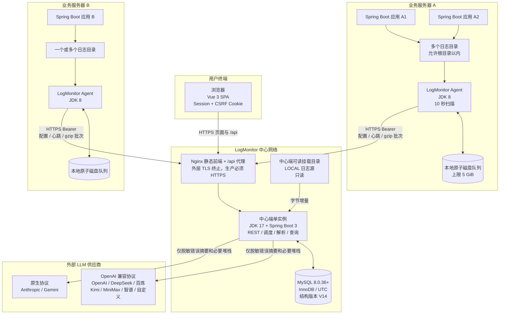
```mermaid
flowchart TB
    subgraph user_zone["用户终端"]
        browser["浏览器\nVue 3 SPA\nSession + CSRF Cookie"]
    end

    subgraph center_zone["LogMonitor 中心网络"]
        proxy["Nginx 静态前端 + /api 代理\n外层 TLS 终止，生产必须 HTTPS"]
        center["中心端单实例\nJDK 17 + Spring Boot 3\nREST / 调度 / 解析 / 查询"]
        mysql[("MySQL 8.0.36+\nInnoDB / UTC\n结构版本 V14")]
        local_mount["中心端可读挂载目录\nLOCAL 日志源\n只读"]
    end

    subgraph host_a["业务服务器 A"]
        app_a1["Spring Boot 应用 A1"]
        app_a2["Spring Boot 应用 A2"]
        logs_a["多个日志目录\n允许根目录以内"]
        agent_a["LogMonitor Agent\nJDK 8\n10 秒扫描"]
        spool_a[("本地原子磁盘队列\n上限 5 GiB")]
        app_a1 --> logs_a
        app_a2 --> logs_a
        logs_a --> agent_a
        agent_a <--> spool_a
    end

    subgraph host_b["业务服务器 B"]
        app_b["Spring Boot 应用 B"]
        logs_b["一个或多个日志目录"]
        agent_b["LogMonitor Agent\nJDK 8"]
        spool_b[("本地原子磁盘队列")]
        app_b --> logs_b --> agent_b
        agent_b <--> spool_b
    end

    subgraph external_zone["外部 LLM 供应商"]
        openai_compatible["OpenAI 兼容协议\nOpenAI / DeepSeek / 百炼\nKimi / MiniMax / 智谱 / 自定义"]
        native_llm["原生协议\nAnthropic / Gemini"]
    end

    browser -->|"HTTPS 页面与 /api"| proxy --> center
    center <--> mysql
    local_mount -->|"字节增量"| center
    agent_a -->|"HTTPS Bearer\n配置 / 心跳 / gzip 批次"| proxy
    agent_b -->|"HTTPS Bearer\n配置 / 心跳 / gzip 批次"| proxy
    center -->|"仅脱敏错误摘要和必要堆栈"| openai_compatible
    center -->|"仅脱敏错误摘要和必要堆栈"| native_llm
```

### 2.1 部署边界

| 边界 | 运行内容 | 持久化内容 | 不持久化内容 |
| --- | --- | --- | --- |
| 浏览器 | SPA、筛选状态、主题、语言 | `localStorage` 中的主题和语言偏好 | 用户密码、供应商 API Key |
| 中心端 | API、认证授权、采集、解析、聚合、查询、LLM 调用 | 由 MySQL 持久化业务状态 | 普通原始日志、Agent 原始 gzip 批次 |
| Agent | 配置轮询、目录扫描、游标、压缩、补传、心跳 | `agent.json`、`state.json`、`sources.json`、spool | 用户注册密码 |
| MySQL | 账号、来源、游标、聚合、错误、LLM 配置和结果 | 180 天窗口内的日志派生数据 | 明文 Agent Token、明文 LLM Key |
| LLM 供应商 | 按需生成错误分析 | 由上游策略决定 | LogMonitor 不发送普通日志和未脱敏敏感信息 |

生产形态由三个独立发布包组成：Nginx 提供版本化 SPA 静态资源并把 `/api` 代理到纯 API 后端，后端和远端 Agent 由包内控制脚本以 nohup JAR 进程运行；TLS 入口必须让页面和 API 保持同源。Agent 启动前使用本地 Token 访问中心配置接口完成严格预检。生产后端启动只读校验 MySQL、InnoDB 和 `schema_metadata`，数据库 SQL 由 DBA 在启动前执行，运行进程不会自动迁移。nohup 不负责开机自启或异常拉起，进程恢复由运维人员或外部平台执行。开发形态由 Vite 在 `5173` 提供页面并把 `/api` 代理到后端 `8080`。

## 3. 中心端进程内部结构

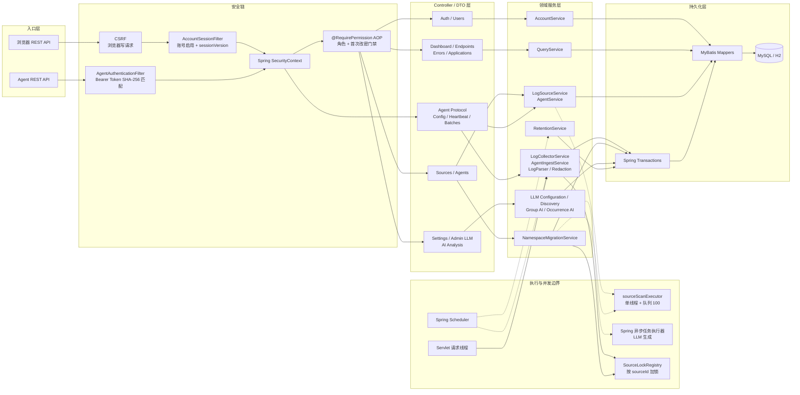
```mermaid
flowchart LR
    subgraph ingress["入口层"]
        browser_api["浏览器 REST API"]
        agent_api["Agent REST API"]
    end

    subgraph security["安全链"]
        csrf["CSRF\n浏览器写请求"]
        agent_filter["AgentAuthenticationFilter\nBearer Token SHA-256 匹配"]
        session_filter["AccountSessionFilter\n账号启用 + sessionVersion"]
        security_context["Spring SecurityContext"]
        permission["@RequirePermission AOP\n角色 + 首次改密门禁"]
    end

    subgraph api_layer["Controller / DTO 层"]
        auth_ctrl["Auth / Users"]
        query_ctrl["Dashboard / Endpoints\nErrors / Applications"]
        source_ctrl["Sources / Agents"]
        llm_ctrl["Settings / Admin LLM\nAI Analysis"]
        agent_ctrl["Agent Protocol\nConfig / Heartbeat / Batches"]
    end

    subgraph services["领域服务层"]
        account_service["AccountService"]
        query_service["QueryService"]
        source_service["LogSourceService\nAgentService"]
        parser_service["LogCollectorService\nAgentIngestService\nLogParser / Redaction"]
        namespace_service["NamespaceMigrationService"]
        llm_service["LLM Configuration / Discovery\nGroup AI / Occurrence AI"]
        retention["RetentionService"]
    end

    subgraph execution["执行与并发边界"]
        request_threads["Servlet 请求线程"]
        source_executor["sourceScanExecutor\n单线程 + 队列 100"]
        app_executor["Spring 异步任务执行器\nLLM 生成"]
        scheduler["Spring Scheduler"]
        source_locks["SourceLockRegistry\n按 sourceId 加锁"]
    end

    subgraph persistence["持久化层"]
        mappers["MyBatis Mappers"]
        tx["Spring Transactions"]
        db[("MySQL / H2")]
    end

    browser_api --> csrf --> session_filter --> security_context --> permission
    agent_api --> agent_filter --> security_context --> agent_ctrl
    permission --> auth_ctrl
    permission --> query_ctrl
    permission --> source_ctrl
    permission --> llm_ctrl

    auth_ctrl --> account_service
    query_ctrl --> query_service
    source_ctrl --> source_service
    source_ctrl --> namespace_service
    llm_ctrl --> llm_service
    agent_ctrl --> source_service
    agent_ctrl --> parser_service

    scheduler -.-> parser_service
    scheduler -.-> retention
    source_service -.-> source_executor
    namespace_service -.-> source_executor
    llm_service -.-> app_executor
    request_threads --> parser_service
    parser_service --> source_locks
    namespace_service --> source_locks

    account_service --> mappers
    query_service --> mappers
    source_service --> mappers
    parser_service --> tx --> mappers
    namespace_service --> tx
    llm_service --> tx
    retention --> tx
    mappers --> db
```

### 3.1 进程内职责划分

| 层 | 核心职责 | 关键约束 |
| --- | --- | --- |
| Controller | 参数校验、权限注解、稳定 DTO 和错误码 | 不直接保存明文密钥或原始批次 |
| Security Filter | 建立或撤销认证上下文 | 浏览器会话和 Agent Token 使用不同认证方式 |
| AOP 权限 | 业务权限、ROOT/USER、首次改密限制 | 前端隐藏菜单不是授权依据 |
| Collector / Ingest | 字节游标、解析、脱敏、去重、事务入库 | 同一 `sourceId` 的扫描、上传、迁移互斥 |
| Query | 命名空间聚合、来源下钻、分页、趋势 | `sourceId` 必须属于所选命名空间 |
| LLM | 配置解密、模型解析、协议适配、缓存 | 分析按模型、提示词版本和语言隔离 |
| MyBatis / Transaction | SQL 和原子状态变更 | 派生数据与游标在同一成功边界推进 |

## 4. 浏览器认证、会话与权限链

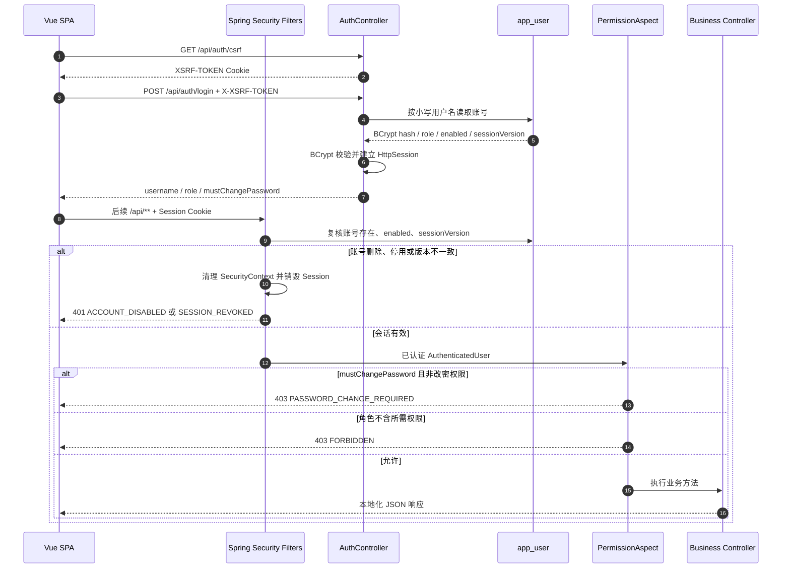
```mermaid
sequenceDiagram
    autonumber
    participant UI as Vue SPA
    participant SEC as Spring Security Filters
    participant AUTH as AuthController
    participant DB as app_user
    participant AOP as PermissionAspect
    participant API as Business Controller

    UI->>AUTH: GET /api/auth/csrf
    AUTH-->>UI: XSRF-TOKEN Cookie
    UI->>AUTH: POST /api/auth/login + X-XSRF-TOKEN
    AUTH->>DB: 按小写用户名读取账号
    DB-->>AUTH: BCrypt hash / role / enabled / sessionVersion
    AUTH->>AUTH: BCrypt 校验并建立 HttpSession
    AUTH-->>UI: username / role / mustChangePassword

    UI->>SEC: 后续 /api/** + Session Cookie
    SEC->>DB: 复核账号存在、enabled、sessionVersion
    alt 账号删除、停用或版本不一致
        SEC->>SEC: 清理 SecurityContext 并销毁 Session
        SEC-->>UI: 401 ACCOUNT_DISABLED 或 SESSION_REVOKED
    else 会话有效
        SEC->>AOP: 已认证 AuthenticatedUser
        alt mustChangePassword 且非改密权限
            AOP-->>UI: 403 PASSWORD_CHANGE_REQUIRED
        else 角色不含所需权限
            AOP-->>UI: 403 FORBIDDEN
        else 允许
            AOP->>API: 执行业务方法
            API-->>UI: 本地化 JSON 响应
        end
    end
```

### 4.1 权限矩阵

| 权限 | ROOT | USER | 使用范围 |
| --- | :---: | :---: | --- |
| `MONITOR_READ` | 是 | 是 | 总览、接口、错误和应用实例选项 |
| `SOURCE_MANAGE` | 是 | 是 | 来源状态、选项、新增、批量新增、删除和修改命名空间 |
| `AGENT_MANAGE` | 是 | 是 | 注册、查看和撤销 Agent |
| `AI_ANALYZE` | 是 | 是 | 错误组和单次错误的 LLM 分析 |
| `LLM_PREFERENCE` | 是 | 是 | 选择当前用户模型 |
| `CHANGE_OWN_PASSWORD` | 是 | 是 | 修改自己的密码 |
| `LLM_CONFIG_MANAGE` | 是 | 否 | 供应商、模型、密钥、默认模型和连接测试 |
| `USER_MANAGE` | 是 | 否 | 创建、停用、启用和删除普通用户 |

所有权限由后端 `@RequirePermission` 切面裁决。`mustChangePassword=true` 时，仅身份查询、退出和修改密码链路可用。

### 4.2 浏览器本地状态

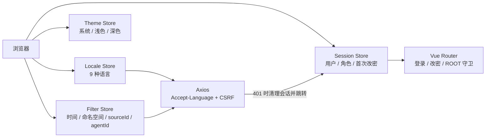
```mermaid
flowchart LR
    browser["浏览器"]
    locale_store["Locale Store\n9 种语言"]
    theme_store["Theme Store\n系统 / 浅色 / 深色"]
    session_store["Session Store\n用户 / 角色 / 首次改密"]
    filter_store["Filter Store\n时间 / 命名空间 / sourceId / agentId"]
    axios["Axios\nAccept-Language + CSRF"]
    router["Vue Router\n登录 / 改密 / ROOT 守卫"]

    browser --> locale_store --> axios
    browser --> theme_store
    browser --> session_store --> router
    browser --> filter_store --> axios
    axios -->|"401 时清理会话并跳转"| session_store
```

主题和语言偏好保存在浏览器 `localStorage`；账号、角色和会话有效性始终由中心端确认。

## 5. 本地目录采集链路

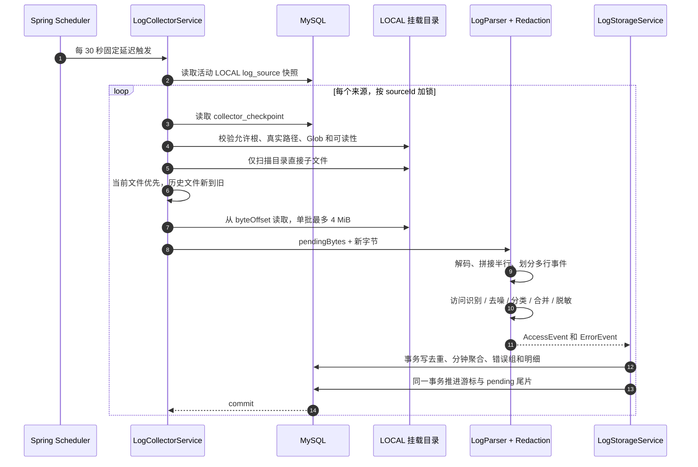
```mermaid
sequenceDiagram
    autonumber
    participant S as Spring Scheduler
    participant C as LogCollectorService
    participant DB as MySQL
    participant FS as LOCAL 挂载目录
    participant P as LogParser + Redaction
    participant L as LogStorageService

    S->>C: 每 30 秒固定延迟触发
    C->>DB: 读取活动 LOCAL log_source 快照
    loop 每个来源，按 sourceId 加锁
        C->>DB: 读取 collector_checkpoint
        C->>FS: 校验允许根、真实路径、Glob 和可读性
        C->>FS: 仅扫描目录直接子文件
        C->>C: 当前文件优先，历史文件新到旧
        C->>FS: 从 byteOffset 读取，单批最多 4 MiB
        C->>P: pendingBytes + 新字节
        P->>P: 解码、拼接半行、划分多行事件
        P->>P: 访问识别 / 去噪 / 分类 / 合并 / 脱敏
        P-->>L: AccessEvent 和 ErrorEvent
        L->>DB: 事务写去重、分钟聚合、错误组和明细
        L->>DB: 同一事务推进游标与 pending 尾片
        DB-->>C: commit
    end
```

### 5.1 文件变化处理

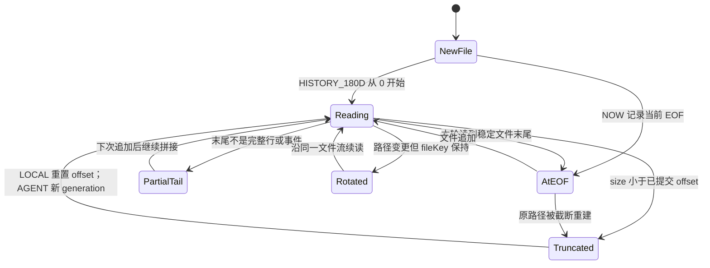
```mermaid
stateDiagram-v2
    [*] --> NewFile
    NewFile --> Reading: HISTORY_180D 从 0 开始
    NewFile --> AtEOF: NOW 记录当前 EOF
    Reading --> PartialTail: 末尾不是完整行或事件
    PartialTail --> Reading: 下次追加后继续拼接
    Reading --> AtEOF: 本轮读到稳定文件末尾
    AtEOF --> Reading: 文件追加
    Reading --> Rotated: 路径变更但 fileKey 保持
    Rotated --> Reading: 沿同一文件流续读
    Reading --> Truncated: size 小于已提交 offset
    Truncated --> Reading: LOCAL 重置 offset；AGENT 新 generation
    AtEOF --> Truncated: 原路径被截断重建
```

游标保存 `sourceId + fileKey + generation + byteOffset + pendingOffset + pendingText/pendingBytes`。Agent 截断时生成新 generation；LOCAL 来源当前使用固定的 `local` generation 并重置 offset。只有派生数据事务提交后才推进已确认位置，因此重启后可以从最后提交点续读。

## 6. 远端 Agent 控制面与数据面

### 6.1 一次性注册和令牌签发

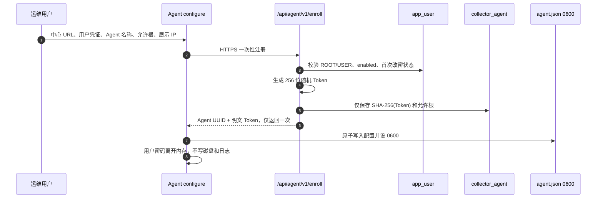
```mermaid
sequenceDiagram
    autonumber
    participant OP as 运维用户
    participant CLI as Agent configure
    participant ENROLL as /api/agent/v1/enroll
    participant USER as app_user
    participant AGENT as collector_agent
    participant DISK as agent.json 0600

    OP->>CLI: 中心 URL、用户凭证、Agent 名称、允许根、展示 IP
    CLI->>ENROLL: HTTPS 一次性注册
    ENROLL->>USER: 校验 ROOT/USER、enabled、首次改密状态
    ENROLL->>ENROLL: 生成 256 位随机 Token
    ENROLL->>AGENT: 仅保存 SHA-256(Token) 和允许根
    ENROLL-->>CLI: Agent UUID + 明文 Token，仅返回一次
    CLI->>DISK: 原子写入配置并设 0600
    CLI->>CLI: 用户密码离开内存，不写磁盘和日志
```

非本机中心地址默认必须使用 HTTPS，证书 SAN 必须覆盖实际域名或 IP，并受 Agent 所用 JDK 8 信任库信任。临时远程 HTTP 连接只能通过 `configure --allow-http` 显式开启，并持久化到 Agent 本地配置；该模式会明文传输注册密码、Agent Token 和日志数据。生产模式不提供跳过 HTTPS 证书校验选项。

### 6.2 Agent 稳态循环

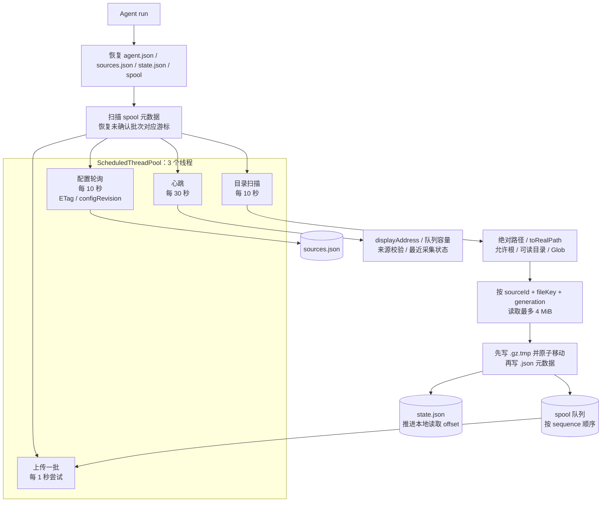
```mermaid
flowchart TB
    start["Agent run"] --> load["恢复 agent.json / sources.json / state.json / spool"]
    load --> recover["扫描 spool 元数据\n恢复未确认批次对应游标"]

    subgraph pool["ScheduledThreadPool：3 个线程"]
        config_poll["配置轮询\n每 10 秒\nETag / configRevision"]
        scan["目录扫描\n每 10 秒"]
        upload["上传一批\n每 1 秒尝试"]
        heartbeat["心跳\n每 30 秒"]
    end

    recover --> config_poll
    recover --> scan
    recover --> upload
    recover --> heartbeat

    config_poll --> remote_config[("sources.json")]
    scan --> validate["绝对路径 / toRealPath\n允许根 / 可读目录 / Glob"]
    validate --> read["按 sourceId + fileKey + generation\n读取最多 4 MiB"]
    read --> atomic_queue["先写 .gz.tmp 并原子移动\n再写 .json 元数据"]
    atomic_queue --> state[("state.json\n推进本地读取 offset")]
    atomic_queue --> spool[("spool 队列\n按 sequence 顺序")]
    spool --> upload
    heartbeat --> report["displayAddress / 队列容量\n来源校验 / 最近采集状态"]
```

虽然调度池有 3 个线程，Agent 的配置、扫描、上传和心跳方法在关键入口上使用同步保护，避免同时修改本地状态文件和队列索引。

### 6.3 可靠上传与中心幂等

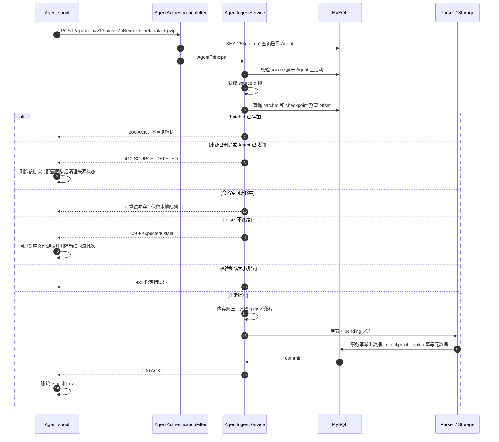
```mermaid
sequenceDiagram
    autonumber
    participant A as Agent spool
    participant F as AgentAuthenticationFilter
    participant I as AgentIngestService
    participant DB as MySQL
    participant P as Parser / Storage

    A->>F: POST /api/agent/v1/batches\nBearer + metadata + gzip
    F->>DB: SHA-256(Token) 查询启用 Agent
    F-->>I: AgentPrincipal
    I->>DB: 校验 source 属于 Agent 且活动
    I->>I: 获取 sourceId 锁
    I->>DB: 查询 batchId 和 checkpoint 期望 offset
    alt batchId 已存在
        I-->>A: 200 ACK，不重复解析
    else 来源已删除或 Agent 已撤销
        I-->>A: 410 SOURCE_DELETED
        A->>A: 删除该批次；配置同步后清理来源状态
    else 命名空间迁移中
        I-->>A: 可重试冲突，保留本地队列
    else offset 不连续
        I-->>A: 409 + expectedOffset
        A->>A: 回退对应文件游标并删除后续同流批次
    else 校验和或大小非法
        I-->>A: 4xx 稳定错误码
    else 正常批次
        I->>I: 内存解压，原始 gzip 不落库
        I->>P: 字节 + pending 尾片
        P->>DB: 事务写派生数据、checkpoint、batch 幂等元数据
        DB-->>I: commit
        I-->>A: 200 ACK
        A->>A: 删除 .json 和 .gz
    end
```

一个批次的关键元数据为：`batchId/sourceId/fileKey/generation/path/startOffset/endOffset/fileSize/modifiedAt/charset/checksum/stable`。中心只保存幂等元数据，不保存原始 gzip 内容。

### 6.4 断网和队列容量

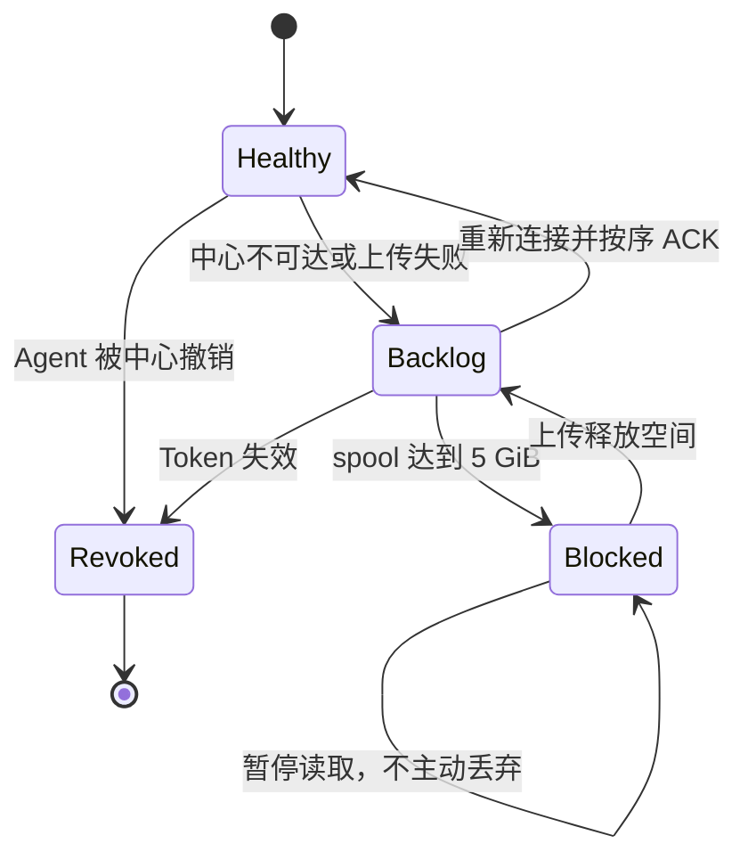
```mermaid
stateDiagram-v2
    [*] --> Healthy
    Healthy --> Backlog: 中心不可达或上传失败
    Backlog --> Healthy: 重新连接并按序 ACK
    Backlog --> Blocked: spool 达到 5 GiB
    Blocked --> Blocked: 暂停读取，不主动丢弃
    Blocked --> Backlog: 上传释放空间
    Healthy --> Revoked: Agent 被中心撤销
    Backlog --> Revoked: Token 失效
    Revoked --> [*]
```

## 7. 从日志字节到查询结果

```mermaid
flowchart LR
    bytes["文件字节增量"] --> decode["按来源 charset 解码"]
    decode --> tail["拼接 pending 半行和未闭合事件"]
    tail --> event_split["时间戳行开始新事件\n后续非时间戳行并入堆栈"]

    event_split --> request_detect["OncePerRequest\n识别 URI 访问"]
    event_split --> error_detect["ERROR / 异常结构识别"]
    error_detect --> noise["排除 LoginInterceptor\n仅打印 URI 的噪声"]
    noise --> merge["同服务、同线程、2 秒内\n包装异常合并"]
    merge --> classify["业务异常 / 系统异常"]
    classify --> associate["关联同线程最近未结束请求\n结果标记 INFERRED 或 NONE"]

    request_detect --> normalize_uri["URI 归一化规则"]
    associate --> redact["统一脱敏\ntoken / Cookie / 密码 / 手机号\n身份证 / IP / 请求体敏感字段"]
    normalize_uri --> access_key["来源 + 文件 + offset + 内容\n生成访问 eventKey"]
    redact --> error_key["来源 + 文件 + offset + 内容\n生成错误 eventKey"]

    access_key --> access_dedup["access_event_dedup"]
    access_dedup --> access_aggregate["api_access_minute\nsourceId + URI + minute"]
    access_aggregate --> baseline["access_dedup_baseline\n重扫边界保护"]

    error_key --> occurrence_dedup["error_occurrence.event_key"]
    occurrence_dedup --> signature["错误签名\n类别 + 根异常类 + 归一化消息\n+ 首个业务栈"]
    signature --> fingerprint["fingerprint = namespace + signature"]
    fingerprint --> group["error_group\n跨实例聚合"]
    group --> occurrence["error_occurrence\n保留 sourceId、文件和脱敏上下文"]

    access_aggregate --> query["Dashboard / Endpoint 查询"]
    group --> query_error["错误分组查询"]
    occurrence --> stream["错误日志流 / 单次详情"]
```

### 7.1 解析与存储不变量

| 不变量 | 运行含义 |
| --- | --- |
| 主日志唯一采集 | 默认排除 `*.error_*.log`，避免主日志和 ERROR 镜像重复 |
| 普通原始日志不落库 | 只保留分钟访问聚合、错误明细和采集状态 |
| 访问方法为 `UNKNOWN` | 当前日志无可靠 HTTP 方法、状态码和耗时，不生成虚假指标 |
| 错误上下文有上限 | 脱敏后最多 100 行或 16 KiB |
| 接口关联是推断 | 只使用同线程最近开放请求；无上下文显示未关联 |
| 事件键不依赖命名空间 | 修改命名空间后重扫不会重复计数 |
| 错误签名不含命名空间 | 同类错误可在新命名空间下重建或合并分组 |
| 游标跟随事务 | 数据写入失败时不提交新的确认 offset |

## 8. 数据模型

### 8.1 账号、Agent 与来源配置

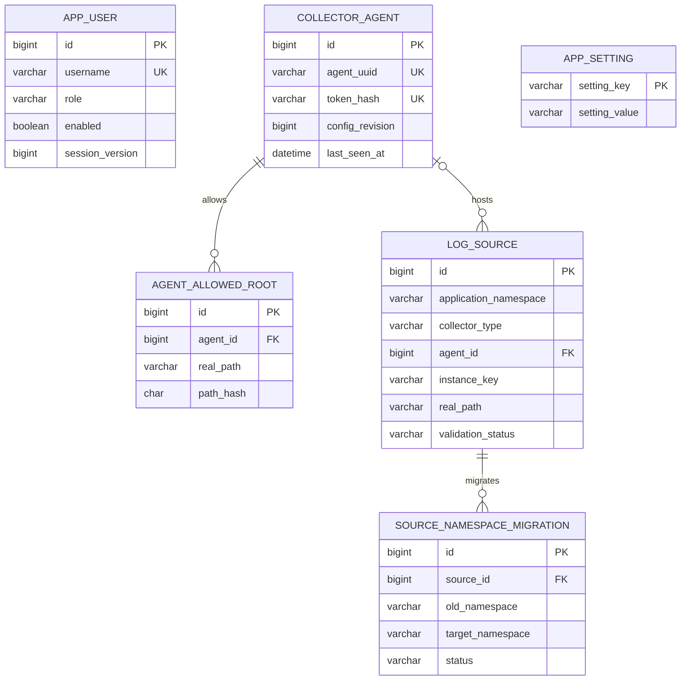
```mermaid
erDiagram
    APP_USER {
        bigint id PK
        varchar username UK
        varchar role
        boolean enabled
        bigint session_version
    }
    COLLECTOR_AGENT {
        bigint id PK
        varchar agent_uuid UK
        varchar token_hash UK
        bigint config_revision
        datetime last_seen_at
    }
    AGENT_ALLOWED_ROOT {
        bigint id PK
        bigint agent_id FK
        varchar real_path
        char path_hash
    }
    LOG_SOURCE {
        bigint id PK
        varchar application_namespace
        varchar collector_type
        bigint agent_id FK
        varchar instance_key
        varchar real_path
        varchar validation_status
    }
    APP_SETTING {
        varchar setting_key PK
        varchar setting_value
    }
    SOURCE_NAMESPACE_MIGRATION {
        bigint id PK
        bigint source_id FK
        varchar old_namespace
        varchar target_namespace
        varchar status
    }

    COLLECTOR_AGENT ||--o{ AGENT_ALLOWED_ROOT : allows
    COLLECTOR_AGENT o|--o{ LOG_SOURCE : hosts
    LOG_SOURCE ||--o{ SOURCE_NAMESPACE_MIGRATION : migrates
```

`collector_agent.created_by` 保存创建用户名快照，不是外键；创建者后续改密、停用或删除不会自动撤销 Agent。`LOCAL` 来源的 `agent_id` 为空，`AGENT` 来源必须归属一个 Agent。

### 8.2 采集、聚合与错误数据

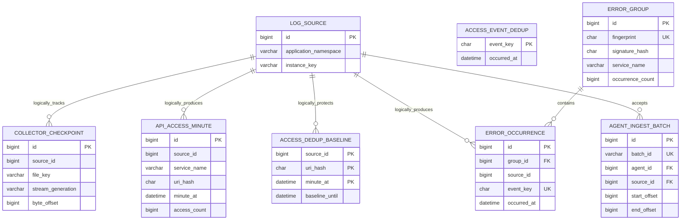
```mermaid
erDiagram
    LOG_SOURCE {
        bigint id PK
        varchar application_namespace
        varchar instance_key
    }
    COLLECTOR_CHECKPOINT {
        bigint id PK
        bigint source_id
        varchar file_key
        varchar stream_generation
        bigint byte_offset
    }
    AGENT_INGEST_BATCH {
        bigint id PK
        varchar batch_id UK
        bigint agent_id FK
        bigint source_id FK
        bigint start_offset
        bigint end_offset
    }
    API_ACCESS_MINUTE {
        bigint id PK
        bigint source_id
        varchar service_name
        char uri_hash
        datetime minute_at
        bigint access_count
    }
    ACCESS_EVENT_DEDUP {
        char event_key PK
        datetime occurred_at
    }
    ACCESS_DEDUP_BASELINE {
        bigint source_id PK
        char uri_hash PK
        datetime minute_at PK
        datetime baseline_until
    }
    ERROR_GROUP {
        bigint id PK
        char fingerprint UK
        char signature_hash
        varchar service_name
        bigint occurrence_count
    }
    ERROR_OCCURRENCE {
        bigint id PK
        bigint group_id FK
        bigint source_id
        char event_key UK
        datetime occurred_at
    }

    LOG_SOURCE ||--o{ COLLECTOR_CHECKPOINT : logically_tracks
    LOG_SOURCE ||--o{ API_ACCESS_MINUTE : logically_produces
    LOG_SOURCE ||--o{ ACCESS_DEDUP_BASELINE : logically_protects
    LOG_SOURCE ||--o{ ERROR_OCCURRENCE : logically_produces
    LOG_SOURCE ||--o{ AGENT_INGEST_BATCH : accepts
    ERROR_GROUP ||--o{ ERROR_OCCURRENCE : contains
```

图中标记为 `logically_*` 的关系由 `source_id` 在应用层维护，但初始化表刻意没有全部建立外键：删除来源要保留历史统计和错误数据。`agent_ingest_batch` 则对 Agent 和来源都有真实外键。

### 8.3 LLM 配置与分析缓存

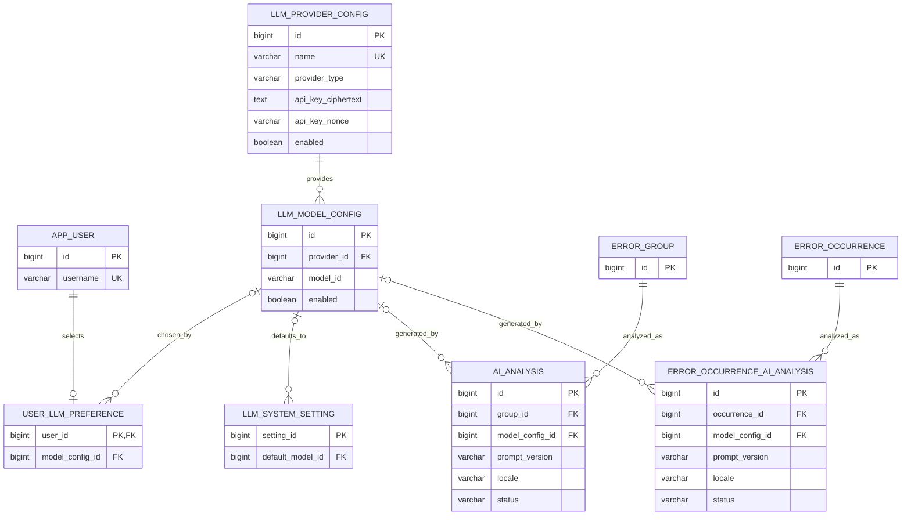
```mermaid
erDiagram
    APP_USER {
        bigint id PK
        varchar username UK
    }
    LLM_PROVIDER_CONFIG {
        bigint id PK
        varchar name UK
        varchar provider_type
        text api_key_ciphertext
        varchar api_key_nonce
        boolean enabled
    }
    LLM_MODEL_CONFIG {
        bigint id PK
        bigint provider_id FK
        varchar model_id
        boolean enabled
    }
    USER_LLM_PREFERENCE {
        bigint user_id PK, FK
        bigint model_config_id FK
    }
    LLM_SYSTEM_SETTING {
        bigint setting_id PK
        bigint default_model_id FK
    }
    ERROR_GROUP {
        bigint id PK
    }
    ERROR_OCCURRENCE {
        bigint id PK
    }
    AI_ANALYSIS {
        bigint id PK
        bigint group_id FK
        bigint model_config_id FK
        varchar prompt_version
        varchar locale
        varchar status
    }
    ERROR_OCCURRENCE_AI_ANALYSIS {
        bigint id PK
        bigint occurrence_id FK
        bigint model_config_id FK
        varchar prompt_version
        varchar locale
        varchar status
    }

    LLM_PROVIDER_CONFIG ||--o{ LLM_MODEL_CONFIG : provides
    APP_USER ||--o| USER_LLM_PREFERENCE : selects
    LLM_MODEL_CONFIG o|--o{ USER_LLM_PREFERENCE : chosen_by
    LLM_MODEL_CONFIG o|--o{ LLM_SYSTEM_SETTING : defaults_to
    ERROR_GROUP ||--o{ AI_ANALYSIS : analyzed_as
    ERROR_OCCURRENCE ||--o{ ERROR_OCCURRENCE_AI_ANALYSIS : analyzed_as
    LLM_MODEL_CONFIG o|--o{ AI_ANALYSIS : generated_by
    LLM_MODEL_CONFIG o|--o{ ERROR_OCCURRENCE_AI_ANALYSIS : generated_by
```

供应商和模型删除时，分析记录通过名称、类型和模型名称快照继续可读；单次错误删除时，其单次 AI 记录级联删除。

### 8.4 20 张表的运行职责

| 表 | 写入者 | 读取者 | 生命周期 |
| --- | --- | --- | --- |
| `schema_metadata` | DBA 初始化/升级脚本 | 生产启动只读校验 | 固定组件行；每次结构升级最后更新 |
| `app_user` | 账号初始化、ROOT 用户管理、改密 | 登录、会话复核、用户列表 | 账号删除时物理删除 |
| `collector_agent` | 注册、心跳、撤销 | Agent 鉴权、服务器页、来源状态 | 撤销后软删除并失效 Token |
| `agent_allowed_root` | Agent 注册 | Agent 详情、远端来源选项 | 跟随 Agent 历史记录 |
| `log_source` | YAML 首迁、来源管理、Agent 撤销 | 采集、配置下发、查询选项 | 逻辑删除；派生历史保留 |
| `app_setting` | 启动迁移器 | YAML 首迁和高级配置同步 | 长期保留 |
| `api_access_minute` | 采集事务 | 总览、接口趋势与排行 | 超过 180 天清理 |
| `error_group` | 错误聚合、命名空间迁移 | 分组列表、详情、AI | 超过保留期且无需要数据时清理 |
| `error_occurrence` | 采集事务 | 错误流、单次详情、分组详情 | 超过 180 天清理 |
| `collector_checkpoint` | LOCAL 或 AGENT 入库事务 | 增量续读、采集状态 | 删除来源时清理；其余持续更新 |
| `llm_provider_config` | ROOT 设置 | LLM 调用、模型发现 | ROOT 物理删除；Key 为密文 |
| `llm_model_config` | ROOT 手工或导入 | 模型解析、用户偏好、AI | ROOT 管理 |
| `user_llm_preference` | 当前用户 | 生效模型解析 | 用户级；用户删除时级联 |
| `llm_system_setting` | ROOT | 模型回退 | 单例设置行 |
| `ai_analysis` | 错误组分析异步任务 | 错误组 AI 面板和历史 | 组、模型、提示词、语言唯一缓存 |
| `error_occurrence_ai_analysis` | 单次错误分析异步任务 | 单次详情 AI 面板和历史 | occurrence 删除时级联 |
| `access_event_dedup` | 访问入库 | 重扫排重 | 超过 180 天清理 |
| `access_dedup_baseline` | 首次/恢复采集 | 历史重放边界排重 | 超过 180 天清理 |
| `source_namespace_migration` | 命名空间修改 | 后台恢复、状态页 | 持久任务记录 |
| `agent_ingest_batch` | Agent 入库事务 | 批次幂等和偏移校验 | 仅元数据，超过 180 天清理 |

## 9. 应用命名空间与实例聚合

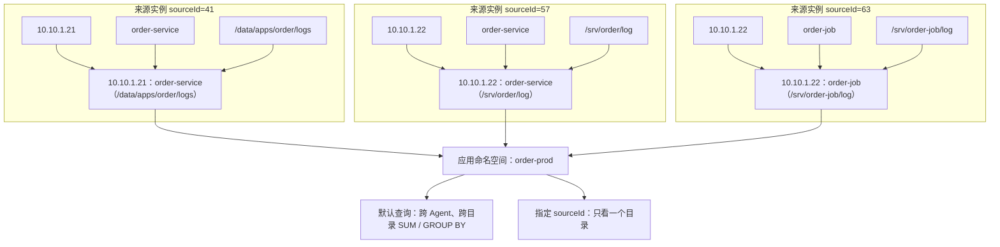
```mermaid
flowchart TB
    ns["应用命名空间：order-prod"]

    subgraph instance_a["来源实例 sourceId=41"]
        agent_a["10.10.1.21"]
        app_a["order-service"]
        path_a["/data/apps/order/logs"]
        label_a["10.10.1.21：order-service（/data/apps/order/logs）"]
        agent_a --> label_a
        app_a --> label_a
        path_a --> label_a
    end

    subgraph instance_b["来源实例 sourceId=57"]
        agent_b["10.10.1.22"]
        app_b["order-service"]
        path_b["/srv/order/log"]
        label_b["10.10.1.22：order-service（/srv/order/log）"]
        agent_b --> label_b
        app_b --> label_b
        path_b --> label_b
    end

    subgraph instance_c["来源实例 sourceId=63"]
        agent_c["10.10.1.22"]
        app_c["order-job"]
        path_c["/srv/order-job/log"]
        label_c["10.10.1.22：order-job（/srv/order-job/log）"]
        agent_c --> label_c
        app_c --> label_c
        path_c --> label_c
    end

    label_a --> ns
    label_b --> ns
    label_c --> ns
    ns --> aggregate["默认查询：跨 Agent、跨目录 SUM / GROUP BY"]
    ns --> drilldown["指定 sourceId：只看一个目录"]
```

### 9.1 筛选语义

| 参数组合 | 查询语义 |
| --- | --- |
| 不传命名空间和来源 | 除错误日志流外，查看全部应用命名空间 |
| 仅 `applicationNamespace` | 聚合同命名空间的所有活动和历史来源 |
| `applicationNamespace + sourceId` | 下钻一个具体目录 |
| 仅旧 `service` | 一个兼容周期内映射为命名空间 |
| 旧 `agentId` | 继续按服务器筛选，适合兼容旧客户端 |
| `sourceId` 不属于命名空间 | 返回 `SOURCE_NAMESPACE_MISMATCH`，不静默改写条件 |

错误分组的 `fingerprint` 包含命名空间而不包含实例，因此同命名空间的相同错误会跨 Agent 聚合；`error_occurrence` 仍保留 `sourceId`、`instanceKey`、服务器和文件位置以支持下钻。

### 9.2 命名空间迁移

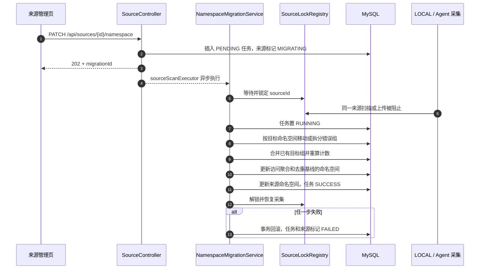
```mermaid
sequenceDiagram
    autonumber
    participant UI as 来源管理页
    participant API as SourceController
    participant MIG as NamespaceMigrationService
    participant LOCK as SourceLockRegistry
    participant DB as MySQL
    participant COL as LOCAL / Agent 采集

    UI->>API: PATCH /api/sources/{id}/namespace
    API->>DB: 插入 PENDING 任务，来源标记 MIGRATING
    API-->>UI: 202 + migrationId
    API-->>MIG: sourceScanExecutor 异步执行
    MIG->>LOCK: 等待并锁定 sourceId
    COL->>LOCK: 同一来源扫描或上传被阻止
    MIG->>DB: 任务置 RUNNING
    MIG->>DB: 按目标命名空间移动或拆分错误组
    MIG->>DB: 合并已有目标组并重算计数
    MIG->>DB: 更新访问聚合和去重基线的命名空间
    MIG->>DB: 更新来源命名空间，任务 SUCCESS
    MIG->>LOCK: 解锁并恢复采集
    alt 任一步失败
        MIG->>DB: 事务回滚，任务和来源标记 FAILED
    end
```

中心重启时会重新提交 `PENDING/RUNNING` 的持久化迁移任务。整组移动可保留原组 AI；拆分新组不复制旧组 AI；单次错误 AI 始终随 occurrence 保留。

## 10. 查询与前端刷新链路

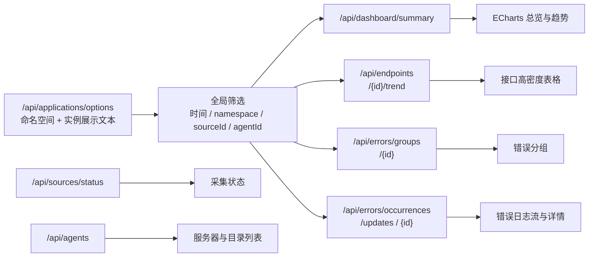
```mermaid
flowchart LR
    filters["全局筛选\n时间 / namespace / sourceId / agentId"]
    options["/api/applications/options\n命名空间 + 实例展示文本"]
    summary["/api/dashboard/summary"]
    endpoints["/api/endpoints\n/{id}/trend"]
    groups["/api/errors/groups\n/{id}"]
    occurrences["/api/errors/occurrences\n/updates / {id}"]
    sources["/api/sources/status"]
    agents["/api/agents"]

    filters --> summary
    filters --> endpoints
    filters --> groups
    filters --> occurrences
    options --> filters
    summary --> charts["ECharts 总览与趋势"]
    endpoints --> endpoint_table["接口高密度表格"]
    groups --> group_table["错误分组"]
    occurrences --> stream["错误日志流与详情"]
    sources --> status["采集状态"]
    agents --> server["服务器与目录列表"]
```

### 10.1 实时错误日志流

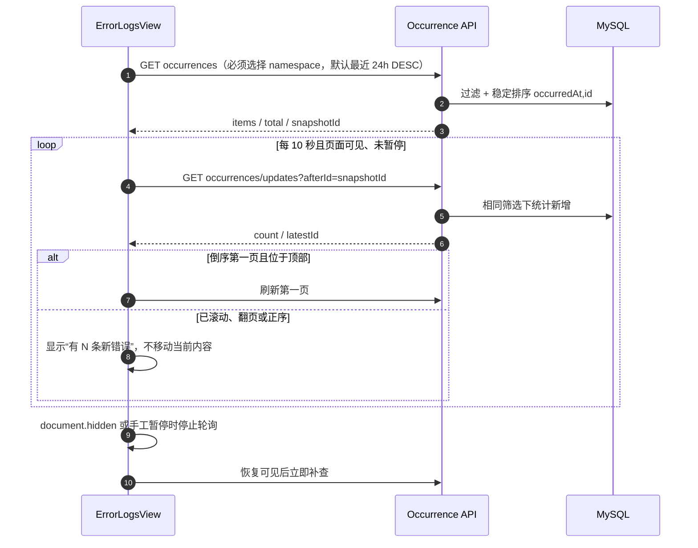
```mermaid
sequenceDiagram
    autonumber
    participant UI as ErrorLogsView
    participant API as Occurrence API
    participant DB as MySQL

    UI->>API: GET occurrences（必须选择 namespace，默认最近 24h DESC）
    API->>DB: 过滤 + 稳定排序 occurredAt,id
    API-->>UI: items / total / snapshotId
    loop 每 10 秒且页面可见、未暂停
        UI->>API: GET occurrences/updates?afterId=snapshotId
        API->>DB: 相同筛选下统计新增
        API-->>UI: count / latestId
        alt 倒序第一页且位于顶部
            UI->>API: 刷新第一页
        else 已滚动、翻页或正序
            UI->>UI: 显示“有 N 条新错误”，不移动当前内容
        end
    end
    UI->>UI: document.hidden 或手工暂停时停止轮询
    UI->>API: 恢复可见后立即补查
```

列表只返回摘要；点击行进入 `/errors/logs/:occurrenceId` 后才加载完整脱敏消息、堆栈、文件、偏移、线程、实例和接口关联。

## 11. LLM 配置、模型发现与错误分析

### 11.1 配置与密钥边界

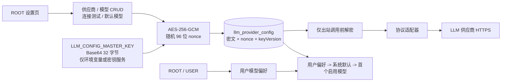
```mermaid
flowchart LR
    root["ROOT 设置页"] --> manage["供应商 / 模型 CRUD\n连接测试 / 默认模型"]
    manage --> crypto["AES-256-GCM\n随机 96 位 nonce"]
    master["LLM_CONFIG_MASTER_KEY\nBase64 32 字节\n仅环境变量或密钥服务"] --> crypto
    crypto --> provider_db[("llm_provider_config\n密文 + nonce + keyVersion")]
    provider_db --> decrypt["仅出站调用前解密"]
    decrypt --> clients["协议适配器"]
    clients --> upstream["LLM 供应商 HTTPS"]

    user["ROOT / USER"] --> preference["用户模型偏好"]
    preference --> resolve["用户偏好 -> 系统默认 -> 首个启用模型"]
    provider_db --> resolve
```

启动时主密钥缺失或格式无效会快速失败。管理 API 只返回 `apiKeyConfigured`，不返回密文、nonce、掩码片段或明文。

### 11.2 模型发现和导入

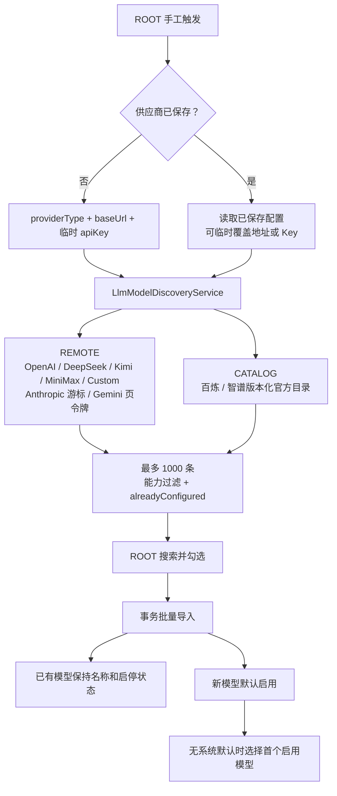
```mermaid
flowchart TB
    root["ROOT 手工触发"] --> saved{"供应商已保存？"}
    saved -->|"否"| form["providerType + baseUrl + 临时 apiKey"]
    saved -->|"是"| stored["读取已保存配置\n可临时覆盖地址或 Key"]
    form --> discovery["LlmModelDiscoveryService"]
    stored --> discovery

    discovery --> remote["REMOTE\nOpenAI / DeepSeek / Kimi / MiniMax / Custom\nAnthropic 游标 / Gemini 页令牌"]
    discovery --> catalog["CATALOG\n百炼 / 智谱版本化官方目录"]
    remote --> result["最多 1000 条\n能力过滤 + alreadyConfigured"]
    catalog --> result
    result --> select["ROOT 搜索并勾选"]
    select --> import_api["事务批量导入"]
    import_api --> existing["已有模型保持名称和启停状态"]
    import_api --> new_model["新模型默认启用"]
    new_model --> default["无系统默认时选择首个启用模型"]
```

在线发现失败不会静默降级为静态目录，也不会删除、停用或修改本次未返回的本地模型。

### 11.3 错误组和单次错误分析

```mermaid
sequenceDiagram
    autonumber
    participant UI as Shared AI Panel
    participant API as AI Controller
    participant R as Model Resolver
    participant DB as MySQL
    participant ASYNC as Async Analysis Service
    participant LLM as Provider Adapter

    UI->>API: GET 当前分析，携带 Accept-Language
    API->>R: 解析用户实际生效模型
    R->>DB: 用户偏好 -> 系统默认 -> 首个启用模型
    API->>DB: 查询 entity + model + promptVersion + locale
    alt 当前语言缓存存在
        DB-->>UI: RUNNING / SUCCESS / FAILED
    else 仅其他语言成功结果存在
        DB-->>UI: 返回最近结果并标记语言回退
    else 无结果
        DB-->>UI: 未分析，不自动产生费用
    end

    UI->>API: POST 分析，可选 refresh=true
    API->>DB: 插入或原子更新为 RUNNING
    API-->>UI: 立即返回 RUNNING
    API-->>ASYNC: 捕获 locale、用户、模型和脱敏错误快照
    ASYNC->>LLM: 结构化提示词 + 脱敏必要堆栈
    LLM-->>ASYNC: JSON 或可用原始文本
    ASYNC->>DB: SUCCESS + 结构化结果 / 文本 / Token
    alt 超时、限流、5xx 或协议失败
        ASYNC->>DB: 有限重试后 FAILED + 脱敏失败原因
    end
    UI->>API: 轮询直至终态
```

错误组使用提示词 `v3-localized`，缓存键为 `groupId + modelConfigId + promptVersion + locale`；单次错误使用 `v4-occurrence-localized`，缓存键将 `groupId` 替换为 `occurrenceId`。跨用户共享同一模型、版本和语言的结果，`refresh=true` 替换该缓存项的当前结果。

### 11.4 协议适配

| 协议 | 供应商 | 生成端点与认证 |
| --- | --- | --- |
| OpenAI Compatible | OpenAI、DeepSeek、百炼、Kimi、MiniMax、智谱、自定义 | `/chat/completions`，Bearer Token |
| Anthropic | Claude | `/v1/messages`，`x-api-key` + 版本头 |
| Gemini | Google Gemini | `/models/{model}:generateContent`，`x-goog-api-key` |

默认生成超时由 `LLM_TIMEOUT_SECONDS` 控制，当前默认值为 120 秒；连接测试默认 15 秒；输出上限默认 2048 Token。重试受客户端错误类型和 `LLM_MAX_RETRIES` 共同约束。

## 12. 关键状态机

### 12.1 Agent 在线状态

```mermaid
stateDiagram-v2
    [*] --> Online: 注册后持续心跳
    Online --> Offline: 超过 90 秒无心跳
    Blocked --> Offline: 阻塞期间心跳中断
    Error --> Offline: 异常期间心跳中断
    Offline --> Online: 心跳恢复
    Online --> Blocked: spoolBytes 达到上限
    Blocked --> Online: 队列回落
    Online --> Error: 任一来源心跳报告错误
    Error --> Online: 后续心跳不再报告错误
    Online --> Revoked: 用户撤销 Agent
    Offline --> Revoked: 用户撤销 Agent
    Blocked --> Revoked: 用户撤销 Agent
    Error --> Revoked: 用户撤销 Agent
    Revoked --> [*]
```

Agent 顶层状态根据最后心跳、队列容量和来源报告派生为在线、离线、阻塞或异常；具体目录的校验结果同时保留在来源状态，便于定位是哪一个目录导致 Agent 显示异常。

### 12.2 远端来源校验状态

```mermaid
stateDiagram-v2
    [*] --> Validating: 中心创建 AGENT 来源
    Validating --> Active: Agent 校验通过并心跳回报
    Validating --> Error: 路径、权限、允许根或 Glob 失败
    Active --> Blocked: Agent 队列满
    Blocked --> Active: 队列释放
    Active --> Offline: Agent 超过 90 秒无心跳
    Offline --> Active: 心跳和校验恢复
    Error --> Active: 本机条件修复后重新校验
    Active --> Migrating: 修改命名空间
    Migrating --> Active: 迁移成功
    Migrating --> MigrationFailed: 迁移失败
    MigrationFailed --> Migrating: 用户重新发起修复迁移
    Active --> Deleted: 删除来源或撤销 Agent
    Deleted --> [*]
```

页面状态是来源自身校验状态、Agent 在线状态、队列状态和命名空间迁移状态的组合视图，不等同于 `log_source.validation_status` 单列。

### 12.3 AI 分析状态

```mermaid
stateDiagram-v2
    [*] --> NotAnalyzed
    NotAnalyzed --> Running: 用户按需触发
    Running --> Success: 结构化 JSON 或文本兜底入库
    Running --> Failed: 重试后仍失败
    Success --> Running: refresh=true
    Failed --> Running: 用户重试
```

## 13. 调度、并发与容量参数

| 运行任务 | 默认周期/上限 | 并发控制 | 目的 |
| --- | --- | --- | --- |
| 中心 LOCAL 扫描 | 固定延迟 30 秒，启动后约 1 秒首次运行 | Spring 调度线程；每来源 `tryLock`，忙时跳过本轮 | 追加、轮转、截断和历史回溯 |
| 新来源立即扫描 | 创建后异步提交 | 同一单线程队列 | 不等待下一轮 30 秒调度 |
| 命名空间迁移 | API 提交后异步；重启恢复 | 同一执行器 + 来源锁 +事务 | 暂停该来源并迁移历史派生数据 |
| Agent 配置轮询 | 10 秒 | Agent 同步状态保护，revision/ETag | 获取一个 Agent 的全部活动目录 |
| Agent 文件扫描 | 10 秒 | 本地状态同步；每批最大 4 MiB | 读取增量并先落本地队列 |
| Agent 上传 | 每 1 秒尝试一批 | spool 顺序、中心来源锁 | 按文件和 offset 可靠补传 |
| Agent 心跳 | 30 秒 | 本地状态同步 | 在线、容量和来源校验报告 |
| Agent 离线阈值 | 90 秒 | 查询时派生状态 | 区分短时抖动与离线 |
| Agent spool | 5 GiB 默认上限 | 满后停止读取、不丢弃 | 断网缓冲 |
| 错误流新增检查 | 10 秒 | 页面隐藏/暂停时停止 | 避免全量刷新和页面跳动 |
| LLM 分析 | 用户按需触发 | 唯一缓存键 + 异步任务 | 避免重复计费并立即返回 RUNNING |
| 数据保留清理 | 每日 03:15，Asia/Shanghai | 单事务定时任务 | 清理 180 天前派生数据和批次元数据 |

目标环境为不超过 20 台 Agent、总日志量不超过 10 GiB/天。当前中心端是单实例，来源锁和数据库唯一键是并发正确性的核心，不提供跨中心节点的分布式锁。

## 14. 故障与恢复路径

```mermaid
flowchart TB
    failure{"故障位置"}
    failure -->|"中心进程停止"| center_stop["LOCAL 游标留在最后提交点\nAgent 继续写 spool"]
    failure -->|"MySQL 事务失败"| db_fail["派生数据和 checkpoint 一起回滚\n下轮重新读取"]
    failure -->|"Agent 进程停止"| agent_stop["state + sources + spool 原子文件保留\n重启 recoverQueuedOffsets"]
    failure -->|"网络中断"| network["上传失败但批次保留\n恢复后按 sequence 补传"]
    failure -->|"ACK 丢失"| ack["Agent 重传同 batchId\n中心幂等 ACK"]
    failure -->|"offset 冲突"| offset["中心返回 expectedOffset\nAgent 回退并重建后续批次"]
    failure -->|"来源删除"| deleted["中心等待来源锁后软删\n新批次 410，历史派生数据保留"]
    failure -->|"命名空间迁移中断"| migration["任务持久化\n中心重启后恢复 PENDING/RUNNING"]
    failure -->|"LLM 上游异常"| llm_fail["主查询不受影响\n分析记录 FAILED，可手工重试"]

    center_stop --> recover["恢复运行"]
    db_fail --> recover
    agent_stop --> recover
    network --> recover
    ack --> recover
    offset --> recover
    migration --> recover
    llm_fail --> recover
```

| 场景 | 防丢机制 | 防重机制 | 对用户的表现 |
| --- | --- | --- | --- |
| 半行写入 | `pendingBytes/pendingText` 延迟解析 | 完整事件后才生成 eventKey | 下一次追加后出现 |
| 文件改名轮转 | `fileKey` 识别同一文件流 | checkpoint 唯一键 | 沿旧文件续读 |
| 文件截断重建 | 新 generation 从 0 读取 | eventKey 和批次元数据 | 新内容正常进入，旧内容不重复 |
| 中心重启 | MySQL checkpoint | 唯一事件键和分钟聚合键 | 短时延迟后恢复 |
| Agent 重启 | 原子状态和 spool 恢复 | `batchId` 唯一 | 队列继续补传 |
| Agent 断网 | 5 GiB 磁盘队列 | 按序 ACK | 状态为积压或阻塞 |
| Agent 撤销 | Token 立即失效、来源软删 | 410 清理本地批次 | 历史查询保留，停止新增 |
| LLM 限流或超时 | 主业务数据已在库 | 分析缓存状态机 | 只影响 AI 面板 |

## 15. 信任边界与敏感数据

```mermaid
flowchart LR
    subgraph trusted_browser["受信用户会话"]
        user["ROOT / USER"]
        session["HttpOnly SameSite=Strict Session"]
        csrf["XSRF-TOKEN + 请求头"]
    end

    subgraph trusted_center["中心端信任区"]
        auth["BCrypt / Session 校验 / AOP"]
        redact["RedactionService"]
        key_crypto["AES-GCM Key 解密边界"]
        token_hash["Agent Token SHA-256"]
    end

    subgraph semi_trusted_agent["注册 Agent 主机"]
        agent_token["agent.json 0600\n持有明文 Agent Token"]
        logs["业务日志，可能包含敏感内容"]
    end

    subgraph external["外部系统"]
        provider["LLM 供应商"]
    end

    user --> session --> auth
    csrf --> auth
    agent_token -->|"HTTPS Bearer"| token_hash
    logs -->|"HTTPS gzip，中心内存解压"| redact
    redact -->|"脱敏错误摘要和必要堆栈"| key_crypto
    key_crypto -->|"供应商凭证仅在出站请求内"| provider
```

敏感数据控制点：

- 用户密码只以 BCrypt 摘要存储；Agent 注册时输入的用户密码不写 Agent 磁盘。
- Agent Token 明文只存在 Agent 的 `0600` 配置，中心只保存 SHA-256 摘要。
- LLM API Key 以 AES-256-GCM 密文保存，主密钥只从环境变量或密钥服务注入。
- 日志进入错误明细和 LLM 请求前执行同一套脱敏规则。
- Session Cookie 为 HttpOnly、SameSite Strict；生产 profile 要求 Secure。
- 浏览器写请求使用 CSRF Token；Agent API 使用 Bearer Token 并从 CSRF 检查中排除。
- API 错误按 `Accept-Language` 本地化，但机器判断只依赖稳定 `code`。

## 16. 生命周期总览

```mermaid
flowchart LR
    source_create["创建 LOCAL/AGENT 来源"] --> validate["路径与 Glob 校验"]
    validate --> collect["增量采集"]
    collect --> derive["解析、脱敏、去重、聚合"]
    derive --> query["命名空间聚合 / sourceId 下钻"]
    query --> ai["按需 LLM 分析"]
    collect --> migrate["可选：修改命名空间"]
    migrate --> derive
    source_create --> delete["删除来源或撤销 Agent"]
    collect --> delete
    delete --> stop["停止新增并清理 checkpoint"]
    stop --> history["历史统计和错误保留到 180 天"]
    history --> retention["每日保留清理"]
```

## 17. 当前架构限制

- 中心端是单实例，不支持中心集群、高可用或跨节点调度协调。
- Agent 首版仅面向 Linux x86_64 和 JDK 8，不含 Windows、Sidecar、自动升级或远程修改允许根。
- 传输使用直接 HTTPS，不引入 Kafka、对象存储、SSH 拉取或共享文件系统依赖。
- 日志目录只扫描直接子文件，不递归子目录；一个目录在同一实例内只能归属一个来源。
- 普通原始日志不归档到数据库或 OSS，无法用本系统检索任意 INFO/DEBUG 原文。
- 错误流采用 10 秒轮询，不使用 WebSocket 或 SSE。
- 同一个中心端实例内的 LLM 结果是共享缓存，不提供用户私有 API Key、流式生成、配额或费用控制。
- 应用命名空间由用户显式配置，不从日志内容自动识别，也不支持一次跨多个命名空间联合筛选。
- 数据保留期当前固定为 180 天；删除来源不会立即删除派生数据，但标准实例下拉框只列活动来源，历史数据主要继续体现在命名空间聚合中。

## 18. 变更时如何维护本图谱

发生以下任一变化时，应在同一提交中更新本文和 [ARCHITECTURE.md](ARCHITECTURE.md)：

- 新增或删除进程、模块、定时任务、执行器或外部依赖。
- 修改浏览器或 Agent 认证、权限矩阵、密钥保存方式或信任边界。
- 修改日志采集、游标、批次、解析、脱敏、去重、聚合或保留策略。
- 修改命名空间、实例筛选、查询聚合键或错误指纹。
- 新增数据库表、外键、唯一键、生命周期或 Flyway 版本。
- 新增 LLM 协议、模型解析顺序、提示词版本或缓存键。
- 修改部署端口、JDK、Node.js、MySQL 或 Agent 运行要求。

维护时优先修改对应的单主题图，不要把全部细节重新塞回物理部署总览图。
